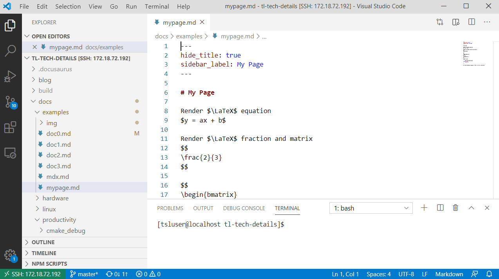
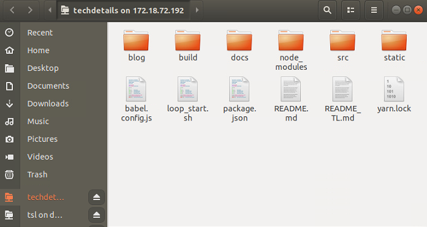
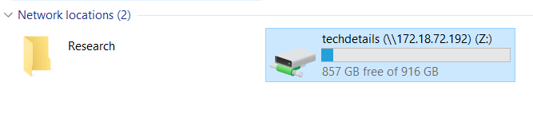
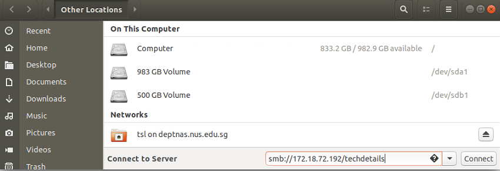
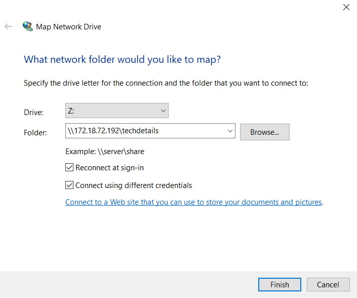
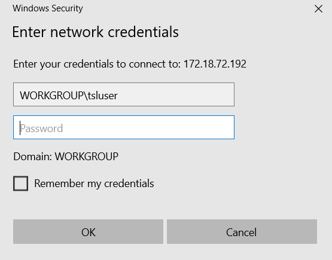
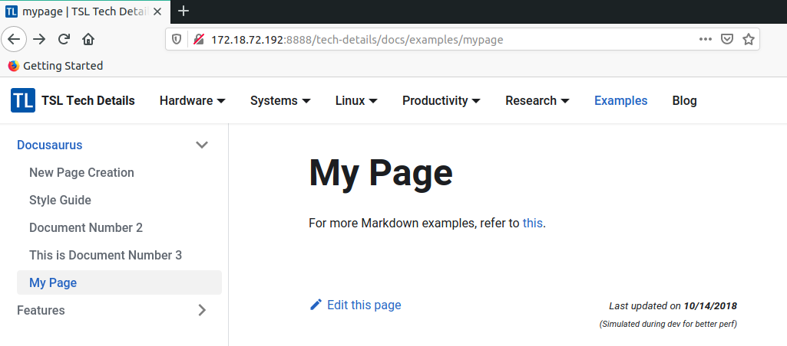

## Overview

The pages are available as source code from our server, available as remote folder. It can be accessed by VS Code directly, or using mounted network drive option.

### Access the Folder in VS Code (Remote SSH)
:::tip
This is the more convenient way of editting the documentation files, and at the same time obtain a command prompt.
:::

In VS Code, install plugin `Remote - SSH`. Then at the bottom-left corner, press the green button `open a remote window`, follow the prompt at the top to proceed for the user at host (`tsluser@172.18.72.192`), password (given to you) key-ins.

> The website folder is located at `~/docusaurus_html/tl-tech-details`.



### Access the Folder (as Files)
All website generation files is located at our server within NUS intranet (VPN is needed if accessing outside NUS)
- `smb://172.18.72.192/techdetails/` for Linux, and
- `\\172.18.72.192\techdetails` for Windows (**Mount as network drive, instead of a network location**)

|   |   |
|---|---|
| Folder displayed in Linux| Mounted Drive in Windows |

:::note Regarding where to put in the address

On Linux machines, go to the file explorer, in the location bar, key in the address and press enter.

|  |  |
|---|---|

On Windows machines, go to file explorer --> This PC (Computer) --> Map network drive, then key in the credentials (switch domain to WORKGROUP)

|  |  |
|---|---|

:::

### File Functions

#### `.md` file
Each page is one `.md` file located in the `docs` subfolder, arranged according to the navigation bar (e.g. `./docs/hardware/` and `./docs/systems`).

#### `sidebars.js` file
To make the page appear on the sidebar, file `./docs/sidebars.js` requires modification

#### `docusaurus.config.js` file
In rarer cases, if a new tab or sub-entries need to be created at the navigation bar (on the top of the website), `docusaurus.config.js` requires modification

## Create a Page

Creating a page is as simple as by creating a file like `mypage.md`. For example, if we create the file under the path `./docs/examples/mypage.md`, then the page should be immediately accessible through the live preview at port 8888: 
> http://172.18.72.192:8888/tech-details/docs/examples/mypage

Within the empty `mypage.md`, add the front matter to configure the title

``` markdown
---
hide_title: true
sidebar_label: My Page
---

# My Title

The rest of your content...
```

The end result should look like this:


Notice that there is no sidebar available for this page, which means the page is currently not browsable unless the exact URL is keyed in. Therefore we will add the page to sidebar next.

## Add a Page to the Sidebar

The file `./docs/sidebars.js` is organised in blocks like this:

``` js
    // systems
    systemsSidebar: {
        'Past Platforms : pixhawk v2': [
            'systems/pixhawk_v1/pixhawk',
        ],
        'Simulations': [
            'systems/simulation/unity-SITL',
            'systems/simulation/unity-HITL',
        ],
        'Vicon': [
            'systems/vicon',
        ],
    },
```

Each block has a name like `systemsSidebar` which is arbitrary (does not affect the website display), but it logically links all relevant documents under one sidebar group.

Within each block, there can be nested levels of sidebar entries, and the format should be self-explanatory. But be reminded of the `,` at various places for the correct syntax. The `.md` postfix should be omitted when mentioning each file.

After adding content in `sidebars.js`, the page should now be rendered like this:



## Add Important Pages to Navigation Bar

The navigation bar is configured within the main `docusaurus.config.js` file. It is under the object `themeConfig.navbar.items`.

Each item can be nested, an example would be:

``` js
    // Systems
    {
        to: 'docs/systems/vicon',
        activeBasePath: 'docs/systems',
        label: 'Systems',
        position: 'left',
        items: [
        
        {
            // activeBasePath:'docs/systems/',
            label: 'Simulations',
            to: 'docs/systems/simulation/unity-SITL'
        },
        {
            // activeBasePath:'docs/systems/',
            label: 'Vicon',
            to: 'docs/systems/vicon'
        },
        {
            // activeBasePath:'docs/systems/pixhawk_v1',
            label: 'Past Platforms : pixhawk v2',
            to: 'docs/systems/pixhawk_v1/pixhawk'
        },
        
        ]
    },
```

Again the syntax should be self-explanatory.

## Preview Your Changes
Preview your live changes at http://172.18.72.192:8888/tech-details/