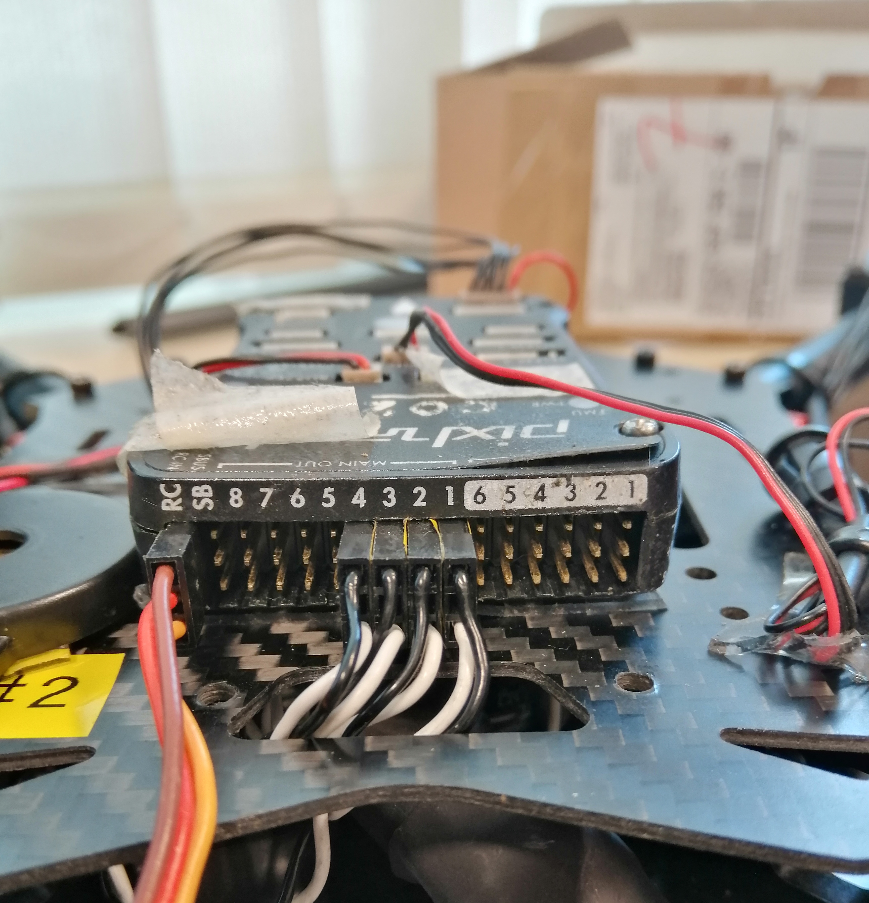
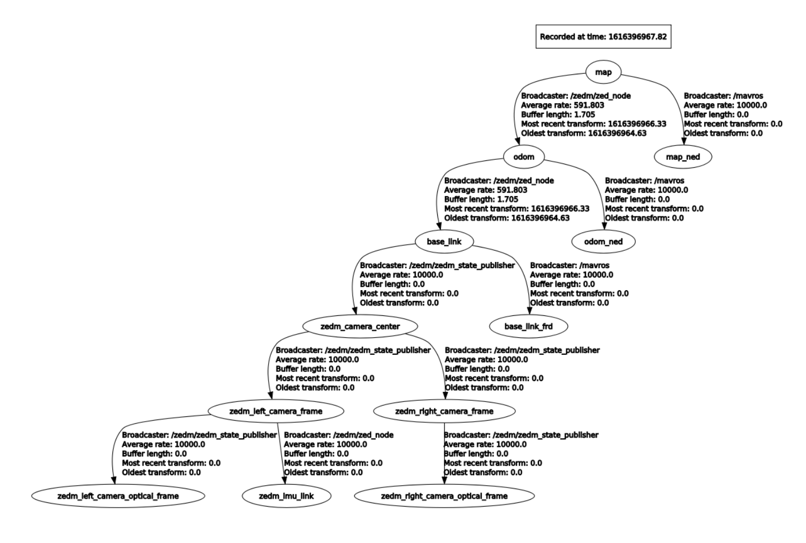

# Overview

Multirotor is a class of rotor craft that our group uses for control, perception and swarm algorithm development and testing.

## Platform

1. Solder ESC GND pads to AUAV Power Module 


2. Place the flight control board on the layer above with buzzer and safety switch connected


3. Connect ESC servo to flight control board 


>Connect ESC servo to **MAIN OUT** (_not AUX OUT_) according to the labelled numbers 


4. Connect receiver to RC on flight control board



:::tip
Always keep the cables neatly arranged and components fixed in place. It is recommended to use cable ties and double-sided tape to help with the practice. Try not to bundle the cable near the propellers for safety purposes.
:::

:::caution
Always check the polarity.
:::

---

## QGroundControl 

1. Download QGroundControl on [DroneCode](https://docs.qgroundcontrol.com/master/en/getting_started/download_and_install.html) (Code is available on [GitHub](https://github.com/mavlink/qgroundcontrol))
2. Run _./QGroundControlAppImage_ on terminal
3. Connect the flight control board to computer via USB port
4. Update the firmware
5. Select correct airframe
6. Connect the vehicle to battery and calibrate ESC PWM Minimum and Maximum
7. Calibrate sensors
8. Set up and calibrate radio (controller)


>In order to connect the controller to receiver, press the LINK/MODE on receiver until the red light start blinking and then turn on the controller. When the light turns green, the connection is done.

9. Set up flight mode

:::note
More detailed information can be found on [Vehicle Setup](https://docs.qgroundcontrol.com/master/en/SetupView/SetupView.html).
:::

:::tip
Safety switch: Double blinking suggests that vehicle can be armed while single blinking suggest that vehicle is not allowed to be armed.
:::


### **Tuning**
Tuning is required when creating a **new airframe type** or significantly modifying an existing supported frame. Generally if you're using a supported configuration (e.g. using an airframe in QGroundControl > Airframe) the default tuning should be acceptable (particularly for larger frames).

Reference from [PX4UserGuide](https://docs.px4.io/master/en/config_mc/pid_tuning_guide_multicopter.html) and [dronecode](https://madennis.gitbooks.io/px4user/content/en/advanced_config/pid_tuning_guide_multicopter.html).

>All tuning should be performed in the manual Stabilized flight mode.

Go into **settings** > **tuning** > click on the **advance** at the topright corner


**Mavlink Inspector** could also be used to monitor the response from the drone. The response and the command graph should be rather close to one another for a good response from the drone. Check for overshoot or any sluggish response from the drone by feel or looking at the graph. 


### **Step 1: Preparation**
First of all set all parameters to initial values:

1. Set all MC_XXX_P to zero _(ROLL, PITCH, YAW)_
2. Set all MC_XXXRATE_P, MC_XXXRATE_I, MC_XXXRATE_D to **zero**, except MC_ROLLRATE_P and MC_PITCHRATE_P
3. Set MC_ROLLRATE_P and MC_PITCHRATE_P to a small value, e.g. 0.02
4. Set MC_YAW_FF to 0.5

>All gains should be increased slowly, about 20%-30% per iteration, 10% for fine tuning. Large gains may cause very dangerous oscillations.

### **Step 2: Stabilize Roll and Pitch Rates**
**P Gain Tuning**

Parameters: MC_ROLLRATE_P, MC_PITCHRATE_P.

Tilt it in roll or pitch direction, and observe the response. If it oscillates, tune down RATE_P. Once the control response is slow but correct, increase RATE_P until it starts to oscillate. Cut back RATE_P until it does only mildly oscillate or not oscillate any more (about 10% cutback), just over-shoots. Typical value is around 0.1.

**D Gain Tuning**

Parameters: MC_ROLLRATE_D, MC_PITCHRATE_D.

Assuming the gains are in a state where the multi rotor oscillated and RATE_P was slightly reduced. Slowly increase RATE_D, starting from 0.01. Increase RATE_D to stop the last bit of oscillation. If the motors become twitchy, the RATE_D is too large, cut it back. By playing with the magnitudes of RATE_P and RATE_D the response can be fine-tuned. Typical value is around 0.01…0.02.

**I Gain Tuning**

If the roll and pitch rates never reach the setpoint but have an offset, add MC_ROLLRATE_I and MC_PITCHRATE_I gains, starting at 5-10% of the MC_ROLLRATE_P gain value.

### **Step 3: Stabilize Roll and Pitch Angles**
**P Gain Tuning**

Parameters: MC_ROLL_P, MC_PITCH_P.

Set MC_ROLL_P and MC_PITCH_P to a small value, e.g. 3
Tilt it in roll or pitch direction, and observe the response. If it oscillates, tune down P. Once the control response is slow but correct, increase P until it starts to oscillate. Optimal response is some overshoot (~10-20%). After getting stable response fine tune RATE_P, RATE_D again.


### **Step 4: Stabilize Yaw Rate**
**P Gain Tuning**

Parameters: MC_YAWRATE_P.

Set MC_YAWRATE_P to small value, e.g. 0.1

If it oscillates or becomes twitchy, tune down RATE_P. If response is very large even on small movements (full throttle spinning vs idle spinning propellers) reduce RATE_P. Typical value is around 0.2…0.3.

### **Step 5: Stabilize Yaw Angle**
**P Gain Tuning**

Parameters: MC_YAW_P.

Set MC_YAW_P to a low value, e.g. 1
If it oscillates, tune down P. Once the control response is slow but correct, increase P until the response is firm, but it does not oscillate. Typical value is around 2…3.

---

## Pixhawk 

Check out the [website](https://dev.px4.io/master/en/companion_computer/pixhawk_companion.html) to set up the ```TELEM2``` port for companion computer.

---

## Nvidia Jetson Xavier NX

### 1. Set up [Jetson Xavier NX Developer Kit](https://developer.nvidia.com/embedded/learn/get-started-jetson-xavier-nx-devkit#write)

### 2. Install software with SDK Manager

2.1. Download [SDK Manager](https://developer.nvidia.com/nvidia-sdk-manager) on a developer host machine

2.2. Connect Xavier to the developer host machine via micro USB port

2.3. Follow the [instructions](https://docs.nvidia.com/sdk-manager/install-with-sdkm-jetson/index.html) 

:::note
Untick Jetson OS at Step 3
:::

### 3. Install [ROS Melodic](http://wiki.ros.org/melodic/Installation/Ubuntu)

### 4. Follow the _source installation instructions_ at [DroneCode](https://dev.px4.io/master/en/ros/mavros_installation.html) to compile [MAVROS](https://github.com/mavlink/mavros/blob/master/mavros/README.md)


:::note
Add the following lines into .bashrc

```
$ sudo apt install nano
$ nano .bashrc
```
```
# Lines to be added
source /opt/ros/melodic/setup.bash
source /home/yt/catkin_ws/devel/setup.bash
```
:::

### 5. Check serial port (TX/RX) using [loopback test](https://amitasinghchauhan.medium.com/serial-port-debugging-101-loopback-test-4a7e40da9055)

5.1. Connect the TX and RX port using one cable in order to perform loopback test

:::tip
The pin configuration of Jetson Xavier NX Developer Kit can be found [here](https://www.jetsonhacks.com/nvidia-jetson-xavier-nx-gpio-header-pinout/).
:::

5.2. Set up Minicom

```
$ sudo apt-get install minicom
$ minicom
```

5.3. Open up Minicom and perform loopback test
```
$ sudo minicom -D /dev/ttyTHS0 
```

- Press Ctrl A-Z 
- Press O to configure minicom 
- Select serial port setup
- Change serial device 

Or 

- Open the minicom in terminal using different tty*

:::note
List of tty* can be found by typing the following code in terminal
```
$ ls /dev/tty*
```
:::

>To verify the TX/RX ports, make sure the content you type in shows on the terminal.

### 6. Modify the line shown below in ```px4.launch``` file

```
# path: ~/catkin_ws/src/mavros/mavros/launch
# line to be modified: 
<arg name ="fcu_url" default="/dev/ttyTHS0:921600">
```

- Set tty to the tty verified in previous step (For example: ```ttyASM0``` -> ```ttyTHS0```)
- Change the baudrate (the number behind tty) to the baudrate of ```TELEM2```

:::note
Check the baudrate of ```TELEM2``` on QGroundControl by searching the parameter ```SER_TEL2_BAUD```.
:::

### 7. Check the connection between PX4 and Jetson Xavier

7.1. Connect RX, TX and GND pin on Jetson Xavier to ```TELEM2``` on PX4

:::note
Pin configuration of ```TELEM2``` on PX4 (from left to right) is 5V, RX, TX, CTS, RTS, GND.
:::

7.2. Boot up PX4 and check if anything shows up on the Minicom on Jetson Xavier

### 8. Run px4.launch file 

8.1. In ```px4.launch``` file, make sure ```fcu_url``` is modified as stated in step 5

8.2. Change ```gcs_url``` into "udp://@ip_address"  

>The IP address inserted is the IP address of the computer where QGroundControl will run on. Therefore, when ```px4.launch``` file runs, the QGroundControl will be automatically connected to the pixhawk.

8.3. Run the following command in terminal
```
$ roslaunch mavros px4.launch
```
```
# Can try the following line if encounter error 
# DeviceError: serial: open: Permission denied
$ sudo chmod a+rw /dev/ttyTHS0
```

:::tip
Compiled information can be found [here](https://github.com/DiegoHerrera1890/Pixhawk-connected-to-Jetson-Tx2-devkit).
:::

:::tip
When UART port ```THS0``` is used to connect to pixhawk, warnings keep showing up while ```px4.launch``` file is running. However, when USB port ```USB0``` is used, ```px4.launch``` file runs normally.
:::

---

## Vicon

Check out [website](https://tlab-uav.github.io/tech-details/docs/systems/vicon/) to setup vicon.

---

## Camera

**1. Check CUDA version**

Jetson Xavier has CUDA 10.2 pre-installed by SDK Manager

```
# insert the following lines in .bashrc
export PATH=/usr/local/cuda-10.2/bin${PATH:+:${PATH}}$
export LD_LIBRARY_PATH=/usr/local/cuda-10.2/lib64${LD_LIBRARY_PATH:+:${LD_LIBRA$

# check CUDA version
$ nvcc  --version
$ apt policy cuda  # might have error 
```

**2. Download ZED SDK for Jetpack 4.4 3.3.3 (Jetson Nano, NX, TX2, Xavier, CUDA 10.2) from [Stereolabs](https://www.stereolabs.com/developers/release/)**

**3. Follow the [instructions](https://www.stereolabs.com/docs/installation/linux/) to install ZED SDK**

:::note
The SDK is located at ```/usr/local/zed/tools```
:::

**4. Download [ZED ROS Wrapper](https://www.stereolabs.com/docs/ros/)**
```
$ cd ~/catkin_ws/src
$ git clone https://github.com/stereolabs/zed-ros-wrapper.git
$ cd ../
$ rosdep install --from-paths src --ignore-src -r -y
$ catkin build -DCMAKE_BUILD_TYPE=Release
$ source ./devel/setup.bash
```

**5. Open a terminal and use roslaunch to start the ZED node:**

```
# ZED Mini camera: 
$ roslaunch zed_wrapper zedm.launch
```
**6. Download cv_bridge from [GitHub](https://github.com/ros-perception/vision_opencv)**

**7. Data display with Rviz**
```
$ roslaunch zed_display_rviz display_zedm.launch
$ rosrun rqt_reconfigure rqt_reconfigure
```

:::note
Reference  code used for [cpp](https://zhuanlan.zhihu.com/p/56565582)
:::

---
## VIO

### Coordinate Frames

Frame used in **ZED Mini**: 

```map``` (NWU) -> ```odom``` (NWU) -> ```base_link``` (NWU)

:::note
```map``` is the parent of ```odom``` and ```odom``` is the parent of ```base_link```. The definition of a child frame is based on its parent frame. Both ```map``` and ```odom``` are world-fixed frame while ```base_link``` is attached to the mobile robot base.
:::

Frame conventions (odom) in **ROS**: 

- Body frame: NWU
- World frame: ENU


Frame used in **PX4**: NED

:::note
**Reading**
1. [REP 103](https://www.ros.org/reps/rep-0103.html)
2. [REP 105](https://www.ros.org/reps/rep-0105.html)
:::

### Working principle

Feed ```/mavros/odometry/out``` with ```odom``` data of type ```nav_msgs::Odometry``` in the correct frame according to ROS conventions. Then, the functions in ```odom.cpp``` will transform the frame of ```odom``` data into the frame for MAVLINK (PX4). MAVLINK will fuse the ```odom``` data from ```/mavros/odometry/out``` with internal sensors using ```EKF```. Eventually, the final position that is used by the flight controller will be published at ```/mavros/local_position/pose```.

**About MAVROS**

**odom.cpp**
 * odom_cb() : transforming and sending odometry to fcu
 * handle_odom() : receiving and transforming odometry from fcu

 ```Frame_id``` required by fcu
 * header.frame_id = "odom_ned"
 * child_frame_id = "base_link_frd"


### Steps

With ```zed-ros-wrapper``` and ```mavros``` running, open ```rviz``` to check the frames orientation and open ```rqt``` to check tf_tree.



Since the frames of ```map``` and ```odom``` in ```zed-ros-wrapper``` do ***not*** follow the ROS conventions, the transform by MAVROS from  ```odom``` to ```odom_ned``` is incorrect because it assumes the provided odom data is in ENU (but actually is NWU by ZED). Therefore, changes are needed to be made in code that performs frame transformation. 

In ```mavros/mavros/src/lib/uas_data.cpp```, line 54-68:
```
std::vector<geometry_msgs::TransformStamped> transform_vector;

# from ENU to NED
add_static_transform("map", "map_ned", Eigen::Affine3d(ftf::quaternion_from_rpy(M_PI, 0, M_PI_2)),transform_vector);

# from ENU to NED
add_static_transform("odom", "odom_ned", Eigen::Affine3d(ftf::quaternion_from_rpy(M_PI, 0, M_PI_2)),transform_vector);

# from NWU to NED
add_static_transform("base_link", "base_link_frd", Eigen::Affine3d(ftf::quaternion_from_rpy(M_PI, 0, 0)),transform_vector);
```

In order to match it with ZED frame settings, the following line has to be modified as shown.
```
# from NWU to NED
add_static_transform("odom", "odom_ned", Eigen::Affine3d(ftf::quaternion_from_rpy(M_PI, 0, 0)),transform_vector);

# Modify "map" frame tranformation line if "map_ned" is used.
# The sequence is in (roll, pitch, yaw)
# M_PI = 180 degree
```
Now check the orientation of ```odom_ned``` on Rviz. 

Then, add the following lines in MAVROS launch file to feed the zed camera ```odom``` data to ```/mavros/odometry/out```
```
<!-- You should only remap either vision_pose or odometry, but not both -->
<!-- /mavros/vision_pose/pose is posestamped, where /mavros/vision_pose/pose is posewithcovariancestamped -->

<remap from="/mavros/odometry/out" to="/zedm/zed_node/odom" />
```
Add ```estimator_type: 3``` under _odometry_ in ```px4_config.yaml```.

Run ```roscore```, ```mavros``` and ```zed-ros-wrapper```. Note that ```zed-ros-wrapper``` has to be launched ***after*** messages _Time offset between FCU and OBC has been initialised_ show on the terminal.

On QGC, set parameter ```MAV_ODOM_LP``` = 1 to loop back odometry. Then, check ```ODOMETRY``` at Mavlink Inspector. To verify the frame, perform the following actions. If all are true, it indicates that the frame is transformed correctly.
- Yaw clockwise: Quaternion[3] becomes positive/increases
- Roll to the right: Quaternion[1] becomes positive/increases
- Pitch up: Quaternion[2] becomes positive/increases
- At initial position: The values of quaternion should be close to [1, 0, 0, 0] = [w, x, y, z]


The second problem with ```zed-ros-wrapper``` is ***time synronisation*** between OBC and FCU. The time difference between FCU and OBC is too large. Therefore, ```zed-ros-wrapper``` is modified as following.

In ```zed-ros-wrapper/zed_nodelets/src/zed_nodelet/src/zed_wrapper_nodelet.cpp```, add the following function in public.
```
// Huimin's 
uint64_t get_monotonic_now(void)
{
	struct timespec spec;
	clock_gettime(CLOCK_MONOTONIC, &spec);

	return spec.tv_sec * 1000000000ULL + spec.tv_nsec;
}
```
Then, modify the code accordingly.
```
# line 3230-3240

# Original code:
// Timestamp
if (mSvoMode) {
    mFrameTimestamp = ros::Time::now();
} else {
    mFrameTimestamp = sl_tools::slTime2Ros(mZed.getTimestamp(sl::TIME_REFERENCE::IMAGE));
}

# Modified code:
// Timestamp
if (mSvoMode) {
    mFrameTimestamp = ros::Time::now();
    NODELET_INFO_STREAM("In SVO mode");
} else {
    uint64_t monotonic_time = get_monotonic_now();
    mFrameTimestamp = ros::Time().fromNSec(monotonic_time); 
}

# Note: publishOdom(mOdom2BaseTransf, mLastZedPose, mFrameTimestamp);
```
After catkin build, everything should be working fine. To further optimise VIO, fill the QRC parameter ```EKF2_EV_DELAY``` with the delay time (in milliseconds) between Vision and IMU by checking the Log file using FlightPlot.


---
## Camera Calibration

1. Install dependencies and Kalibr package
```
$ sudo apt-get install python-setuptools python-rosinstall ipython libeigen3-dev libboost-all-dev doxygen libopencv-dev python-software-properties software-properties-common libpoco-dev python-matplotlib python-scipy python-git python-pip ipython libtbb-dev libblas-dev liblapack-dev python-catkin-tools libv4l-dev
```

2. Record the data which will be used for calibration later
```
$ rosbag record -O Kalibr_data.bag /zedm/zed_node/imu/data_raw /zedm/zed_node/left/image_rect_color /zedm/zed_node/right/image_rect_color
```

3. Add ```april_gridl.yaml``` and ```imu-params.yaml``` in the folder

4. Run calibratin file
```
$ kalibr_calibrate_cameras --bag /home/safmc/zed-kalibr/Kalibr_data.bag --topics /zedm/zed_node/left/image_rect_color /zedm/zed_node/right/image_rect_color --models pinhole-radtan pinhole-radtan --target /home/safmc/kalibr_workspace/src/kalibr/april_grid.yaml

$ kalibr_calibrate_imu_camera --bag /home/safmc/zed-kalibr/Kalibr_data.bag --cam camchain-homesafmczed-kalibrKalibr_data.yaml --imu /home/safmc/kalibr_workspace/src/kalibr/imu-params.yaml --target /home/safmc/kalibr_workspace/src/kalibr/april_grid.yaml

# enter full path of Kalibr_data.bag and april_grid.yaml
```
---
## Teraranger Evo 60m

1. Connect the sensor to pixhawk autopilot 
https://www.terabee.com/connection-to-pixhawk-autopilots-teraranger-evo/

2. Enable the parameter SENS_EN_TRANGER in QGC (Parameters->sensors)


> If SENS_EN_TRANGER cannot be found, follow the steps below:
>1. Insert ```distance_sensor/teraranger ```
under ```DRIVERS``` in ```Firmware/boards/px4/fmu-v2/default.cmake``` file.
>
>2. Type ```make px4_fmu-v2``` under ```Firmware``` directory in terminal.
>
>3. Flash the firmware file(```Firmware/build/px4_fmu-v2_default/px4_fmu-v2_Default.px4```) to the board via QGC.
>
>4. Now SENS_EN_TRANGER is visible in the parameters menu.


3. Remove distance_sensor from blacklist in ```~/catkin_ws/src/mavros/mavros/launch/px4_pluginlists.yaml```.

4. Modify px4_config.yaml to configure the sensor.
>Check that ```id``` under publisher is the same as the value found in QGC for ```DISTANCE_SENSOR```.

5. Type this command to check /mavros/distance_sensor/NAME_OF_THE_PUB is running.
```
$ rostopic list
```
6. Type this command to view the readings of the sensor.
```
$ rostopic echo /mavros/distance_sensor/NAME_OF_THE_PUB
```

---

## GitHub
```
# Push commits
$ git add .
$ git commit -m "description"
$ git push origin master
```
---

## Remote desktop

FYI:
Local host is the current host in which you are logged in.
Remote host is the host to which you are trying to connect from the local host .

### Access Ubuntu remotely from Ubuntu

* SSH
1. Make sure both local host and remote host is connected to the same network 
2. On local host, run the following command in terminal
```
$ ssh desktop_name@ip_address_of_remote_host
$ ssh yt@192.168.1.124  #example
```
3. Enter _exit_ to end SSH session

* VNC
1. Make sure _Remmina_ is installed in both host
2. Make sure both local host and remote host is connected to the same network 
3. On remote host, open the Settings, under Sharing, turn on both screen sharing and remote login
4. Open Remmina, select VNC and enter the IP address of remote host 

### Access Ubuntu remotely from Macos

* VNC
1. Make sure both local host and remote host is connected to the same network 
2. Finder > Go > Connect to server > Browse > Select > Share screen (at top right of the window) 

