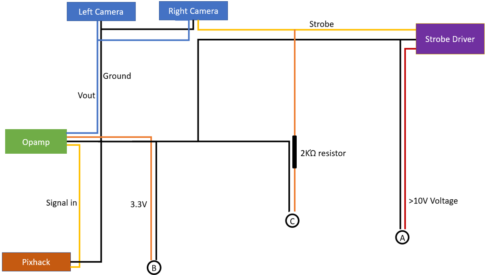
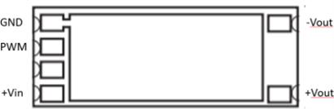
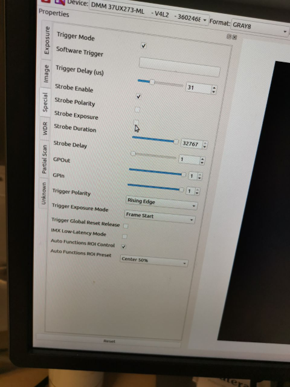

## **Camera and Strobe wiring**

    

> The following below is based on the set used on cam 4. Feel free to
> modify to simplify/improve the design.

**Wiring diagram**

**Camera trigger Opamp**

Camera trigger signal from pixhawk/pixhack has a voltage of 2.3V, while the camera modules require 3.3-5V in order to be counted as an active high signal. An opamp is hence used to amplify the signal.

  

Model: SparkFun OpAmp Breakout - LMV358
Purpose: Amplify signal between pixhawk AUX pins and Camera

Procedures: 

1) Remove the two resistors as above and short using solder. (Blue arrows)

  

2) Connect corresponding wires

 - Vcc: External 3.3/5V voltage from Pixhawk(Serial, GPS port, etc), or Battery
 - Gnd: Ground wire.
 - Out: Out trigger wire, to both camera modules.
 - In: Signal in from Pixhawk/Pixhack.

  

3) Connect OUT signal to Oscilloscope, adjust knob (green arrow) till amplified signal can be seen(3.3V - 5V). Fixed the knob with hot glue.

**LED Flash driver**

Model: RCD-24-PL

Pinout

 - Gnd: Ground
 - PWM: Connected to Strobe out port from one or both camera modules
 - +Vin: >10V voltage from battery
 - +Vout/-Vout: To flash unit

**Strobe setting(Inside tcam capture)**

Important settings:

 - Strobe enable: **[✓]**
 - Strobe exposure: **[x]**
 - Strobe polarity: **[x]**
 - Strobe duration:Substainable (>10K) 
 - Strobe delay : 0
 - Trigger polarity: Rising edge
 - Trigger exposure mode: Frame start
