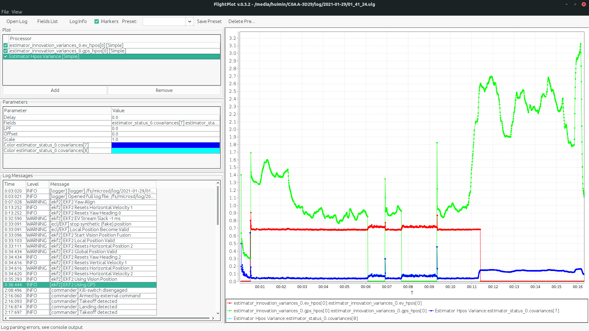

## Sensor Fusiong Data Sources

The inputs of EKF come from visual odometry (ROS -> mavros -> px4) and GPS (directly connected to Pixhawk / PX4).

| Source of Measurement | Mavros Message                                                     | PX4 log message             | MAVLINK Feedback |
| --------------------- | ------------------------------------------------------------------ | --------------------------- | ---------------- |
| Visual Odometry       | `/mavros/odometry/out` remapped to `/basalt/odom_ned` (px4.launch) | `vehicle_visual_odometry_*` |    [ODOMETRY](https://mavlink.io/en/messages/common.html#ODOMETRY) (only if PX4 param MAV_ODOM_LP = 1)   |
| GPS                   | NIL                                                                | `vehicle_gps_position_*`    |     [GPS_RAW_INT](https://mavlink.io/en/messages/common.html#GPS_RAW_INT)             |

:::tip
Recommend to use [flightplot](https://github.com/PX4/FlightPlot/releases) java software to view px4 log.
:::

In this page, we will use the [flight log](./logs/2021-01-29_01_41_24_demo.ulg) from Jan 29th 2021 (auto fast flt flight test) to illustrate.

Before any further tuning of the sensor fusion, it is critical to make sure the measurement data are received by EKF properly, like below:

The data rate for GPS should be around 5Hz, and for vision should be around 8~16Hz. They could also be checked on QGroundControl, the ODOMETRY and GPS_RAW_INT message.

:::tip Changing Vision Frequency
The frequency of the visual odometry is determined by hardware triggering. It is set by `TRIG_INTERVAL` parameter in PX4. Recommend to set to 60ms (~16Hz).

The frequency can be halfed, frome the triggering to the actual visual odometry output, due to the setting of `optical_flow_skip_frames`, [more Info here](/research/vio/basalt-tuning.md#front-end-optical-flow).
:::

The screenshot below shows the system is running with 5Hz of GPS and 8Hz of Visual Odometry (16Hz triggering)

[Intert QGC mavlink message page HERE]

## Recommanded EKF Settings
| Parameter          | Value Recommendations                   |
| ------------------ | --------------------------------------- |
| `EKF2_AID_MASK`    | `73` for GPS and Vision Position Fusion |
| `EKF2_EVP_GATE`    | `5.0`                                   |
| `EKF2_EVP_NOISE`   | `0.8`                                   |
| `EKF2_EV_DELAY`    | `0.0` (hardware sync)                   |
| `EKF2_GPS_CHECK`   | `245`  (default)                        |
| `EKF2_GPS_DELAY`   | `110`  (default)                        |
| `EKF2_GPS_MASK`    | `0`  (default)                          |
| `EKF2_GPS_P_GATE`  | `5.0`                                   |
| `EKF2_GPS_P_NOISE` | `0.5`                                   |

The two important parameters to tune, depending on the vision position update speed / accuracy, are `EKF2_EVP_NOISE` and `EKF2_GPS_P_NOISE`.
- Lower `EKF2_EVP_NOISE` would trust vision measurement more
- Lower `EKF2_GPS_P_NOISE` would trust GPS measurement more

## Checking EKF Status

The EKF is programmed to voice over its status to `QGroundControl` during a status change, through MAVLINK protocol.

A few states that EKF will go through since boot:

1. Very basic: `EKF2 Yaw ALign` and `EKF2 Tilt Align`
2. `EKF2 Local Position Valid`, this can be due to `Start Vision Position Fusion` or `Start GPS Fusion`
3. `EKF2 Global Position Valid`, this will only be true if GPS lock is obtained (indoor flight will not have this)
4. Double confirm that the latest status are `Using Vision Position` and `Using GPS` to ensure proper fusion mode is running

If in doubt, run `ekf2 status` in the px4 console to confirm.

## `EKF2_EVP_NOISE` and `EKF2_GPS_P_NOISE` Tuning

| Variance                                                                | Meaning                              |
| ----------------------------------------------------------------------- | ------------------------------------ |
| `estimator_innovation_variances_0.ev_hpos[0]`                           | Measurement Error Variance of Vision |
| `estimator_innovation_variances_0.gps_hpos[0]`                          | Measurement Error Variance of GPS    |
| `estimator_status_0.covariances[7]` `estimator_status_0.covariances[8]` | State Variance                       |

:::tip
1. State variance should be smaller than the measurement errors, otherwise the filtered result would be unstable
2. The relative variance of Vision of GPS should be comparable. The lower variance measurement will be trusted more
:::

### Test Ratios

Another way to check the working status of sensor fusion, we could look at the test ratios of the Vision and GPS measurement.

A test ratio > 1.0 will indicate that the measurement is rejected. In the event that the sensor is indeed malfunctioning (GPS signal is bad), this ratio should be greater than 1.

Above is a good example of the test ratios, the measurements in general have very small ratios.