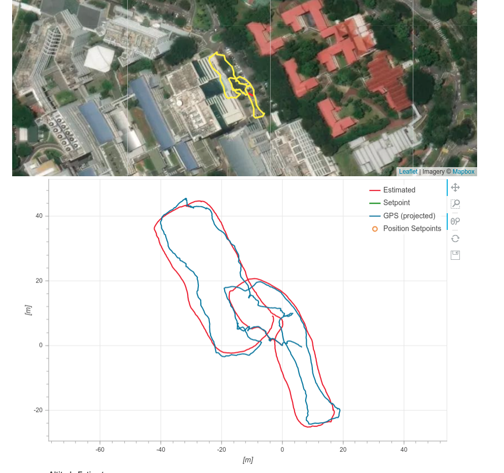
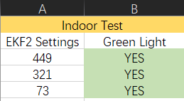
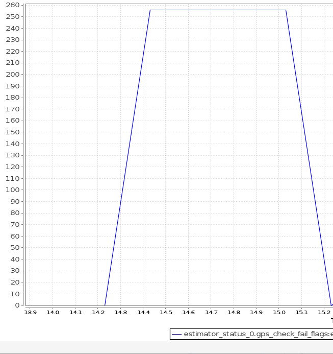
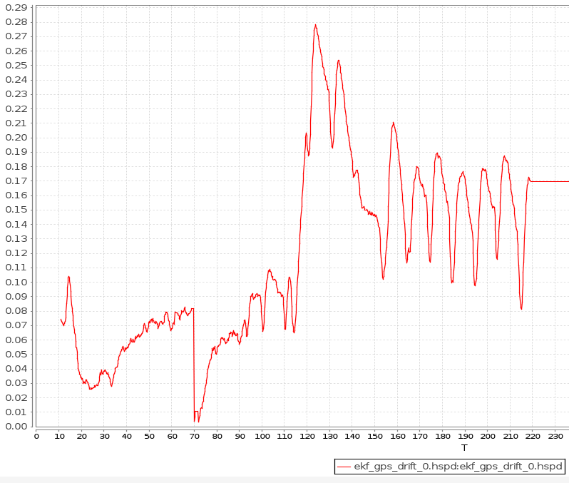
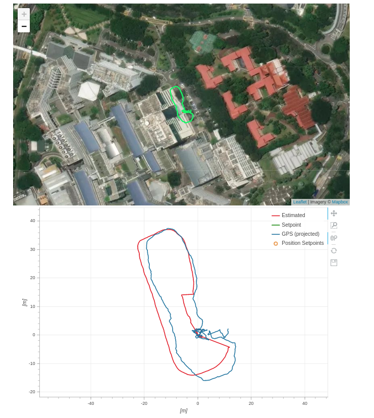
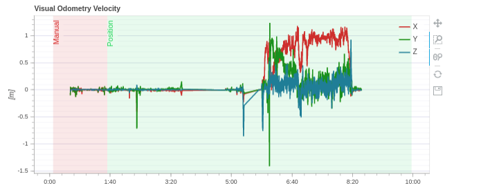
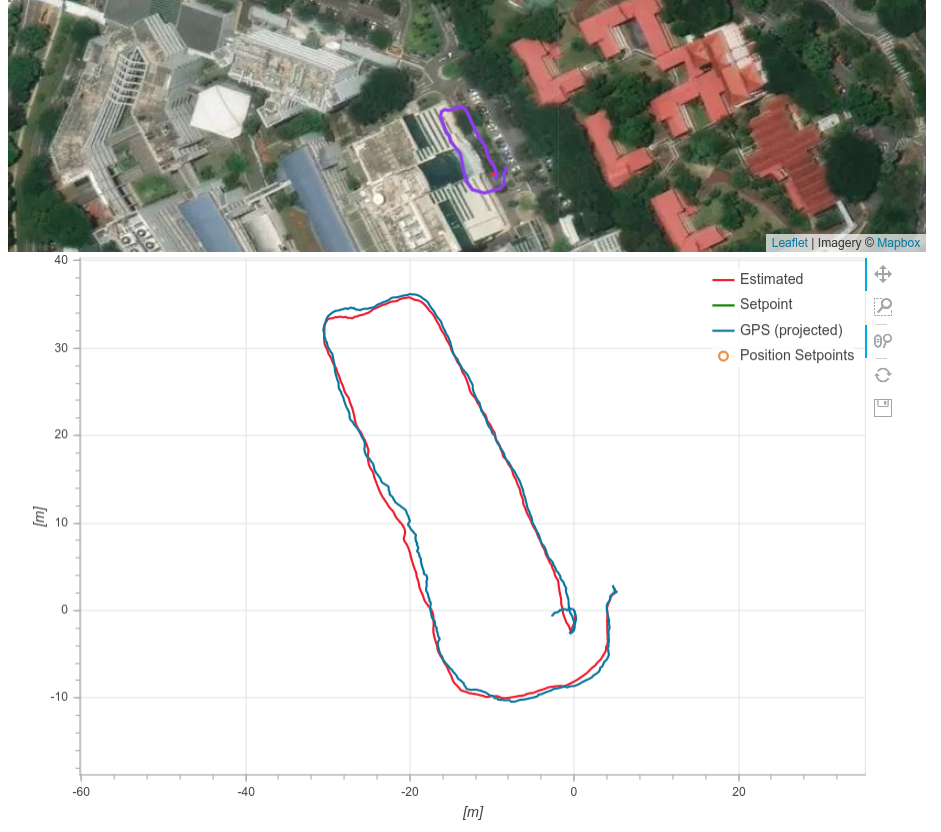
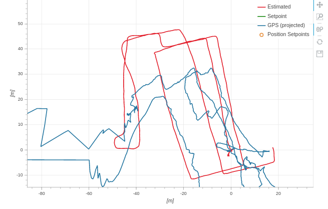

## Coordinate Systems in Use for Fusion

Conclusions:
1. with velocity fusion, the mavros messages about velocity should be in body frame

### Mavros Conversion
**(ROS Message --> MAVLink)**

Mavros supports the conversion of ROS odometry message to MAVLINK odometry message. The coordinate frames are important here.

The MAVLink odometry message is hardcoded with frame of local NED frame, and body frame of NED as well.

```cpp title="odom.cpp"
		mavlink::common::msg::ODOMETRY msg {};
		msg.frame_id = utils::enum_value(MAV_FRAME::LOCAL_FRD);
		msg.child_frame_id = utils::enum_value(MAV_FRAME::BODY_FRD);
```

To get to this settings, the mavros actually does tf transform internally. 
- Firstly it transform the `odom->pose.pose.position` to `odom_ned` frame, from whatever parent frame the odom message is carrying from ROS side.
- For orientation `odom->pose.pose.orientation`, it uses the child `base_link_frd` frame to do the transform
- if we set the ROS message properly, we can effectively by pass the two transformation (performing identity transformation)

To take special note, the linear velocity and angular velocity are in local body frame (`MAV_FRAME::BODY_FRD`), not local map frame!

### PX4 MAVLink Receiver 
**(MAVLink --> uORB)**

The receiver job is simple, it direcly copy the MAVLink odom message position over to the uorb `vehicle_odometry_s` message, assuming local FRD frame. (in function `handle_message_vision_position_estimate()` or `handle_message_odometry()`)

For **linear velocity** and **angular rate**, it must be in local **body** frame FRD (`vehicle_odometry_s::BODY_FRAME_FRD`).

It only supports:
- `MAV_FRAME_BODY_FRD` for `odom.child_frame_id`, which controls the frame for velocity (direct copy without transformation)
- `MAV_FRAME_LOCAL_NED` or `MAV_FRAME_LOCAL_FRD` for `odom.frame_id`, which still does direct one-to-one copy for position and quaternion, but encode the uORB frame accordingly:
  - `odometry.local_frame = vehicle_odometry_s::LOCAL_FRAME_NED`, or
  - `odometry.local_frame = vehicle_odometry_s::LOCAL_FRAME_FRD`  (**MAVROS default**)

:::note The difference between local frame NED and local frame FRD
LOCAL_FRAME_NED has attempt to align with true north and east direction, where as LOCAL_FRAME_FRD has arbitary horizontal alignment.
:::

### PX4 EKF2 External Vision Data Processing 
**(uORB --> EKF Samples)**

The received `vehicle_odometry_s` uORB message is processed in the main `Ekf2::Run()` loop, which is converted to `extVisionSample` datatype:
```cpp
struct extVisionSample {
	Vector3f pos;	///< XYZ position in external vision's local reference frame (m) - Z must be aligned with down axis
	Vector3f vel;	///< FRD velocity in reference frame defined in vel_frame variable (m/sec) - Z must be aligned with down axis
	Quatf quat;		///< quaternion defining rotation from body to earth frame
	Vector3f posVar;	///< XYZ position variances (m**2)
	Matrix3f velCov;	///< XYZ velocity covariances ((m/sec)**2)
	float angVar;		///< angular heading variance (rad**2)
	velocity_frame_t vel_frame = BODY_FRAME_FRD;
	uint64_t time_us;	///< timestamp of the measurement (uSec)
};
```

The velocity frame follows what is in the uORB message, which gives `estimator::BODY_FRAME_FRD` frame. All entries (position, velocity and quaternion) are copied one-to-one in coordinates from uORB message to `extVisionSample`. The message are stored using `setExtVisionData()` function, which in turns stores data to `_ext_vision_buffer`.

:::note
This is to say, the position and attitude is in local FRD frame, and velocity is in body FRD frame (not local!).
:::

### Position / Velocity Fusion Logics
`controlExternalVisionFusion()` Logic in `control.cpp`

#### Regarding EV Rotation
For **every** measurement, if `rotate EV` option is enabled and EV is used, it rotates the EV measurement, aligning the two quaternions! Which generates a rotation matrix `_R_ev_to_ekf`, which express the EV frame in EKF frame, essentially converting coordinates from EV to EKF (local NED).

#### Regarding Position Fusion
If GPS is used, then all position measurement EV gives, would be used as relative measurement. The logic automatically calculates position changes,
```cpp
Vector3f ev_delta_pos = _ev_sample_delayed.pos - _pos_meas_prev;
ev_delta_pos = _R_ev_to_ekf * ev_delta_pos;
```
and rotates this relative position into EKF frame. Think about it, if there is no _R_ev_to_ekf applied, the two coordinate frame will have rotation drift, as the position measurement is originally in `vehicle_odometry_s::LOCAL_FRAME_FRD`, not body frame (it cant be body frame anyway). To make things worse, EV local frame WILL drift, due to is incremental nature, and the drift is NOT observable.

Therefore, rotating the delta position with the current attitude difference between EV and EKF make sense. The delta pose in measured in DRIFTED EV local frame, so to eliminate the drift, we should rotate it to the body frame, hence `_ev_sample_delayed.quat.inversed()`. Thereafter, EKF is expecting the position measurement to be in the local frame, not body frame, hence we need to convert the measurement into a **fake** local measurement, by multiplying the current state rotation, hence `_state.quat_nominal`.

The innovation is calculated as the following:
```cpp
// use the change in position since the last measurement
_ev_pos_innov(0) = _state.pos(0) - _hpos_pred_prev(0) - ev_delta_pos(0);
_ev_pos_innov(1) = _state.pos(1) - _hpos_pred_prev(1) - ev_delta_pos(1);
```
:::tip
Conclusion, it is safe to feed the EKF with odometry measured in EV local frame, with EV rotation turned on. However, the vision position will only be used as a relative measurement.
:::

#### Regarding Velocity Fusion

Lets now analyse the case for velocity fusion. It is programmed in function `getVisionVelocityInEkfFrame()`.

There are two cases:
- (**MAVROS default**) If the velocity is measured in `BODY_FRAME_FRD`, then EV-EKF rotation is not applied, instead it applies
  ```cpp
  vel = _R_to_earth * (_ev_sample_delayed.vel - vel_offset_body);
  ```
  which is essentially from body frame to EKF local frame.
- If the velocity is measured in `LOCAL_FRAME_FRD`, then EV-EKF rotation is applied
  ```cpp
  vel = _R_ev_to_ekf *_ev_sample_delayed.vel - vel_offset_earth;
  ```

:::tip
For velocity fusion, the rotate EV will not make a difference, as Mavros-PX4 interfaces request the velocity to be in body frame in any case.
:::

## GPS Usage in EKF

PX4 Firmware version, 1.11.1 (Sep 2020)

### 10 Oct 2020 (Local Position Estimate & Green Light):


#### Issue 1: GPS Lock Does not Turn Green (Postive Beeping Sequence)

Green light inditates home position set

```cpp title="Relevant logics"
/**
* @brief This function initializes the home position an altitude of the vehicle. This happens first time we get a good GPS fix and each
*		 time the vehicle is armed with a good GPS fix.
**/
bool
Commander::set_home_position()
{
	// Need global and local position fix to be able to set home
	if (status_flags.condition_global_position_valid && status_flags.condition_local_position_valid) {

		const vehicle_global_position_s &gpos = _global_position_sub.get();

		// Ensure that the GPS accuracy is good enough for intializing home
		if ((gpos.eph <= _param_com_home_h_t.get()) && (gpos.epv <= _param_com_home_v_t.get())) {

			const vehicle_local_position_s &lpos = _local_position_sub.get();

			// Set home position
			home_position_s home{};

			home.timestamp = hrt_absolute_time();

			home.lat = gpos.lat;
			home.lon = gpos.lon;
			home.valid_hpos = true;

			home.alt = gpos.alt;
			home.valid_alt = true;

			home.x = lpos.x;
			home.y = lpos.y;
			home.z = lpos.z;

			home.yaw = lpos.heading;
			_heading_reset_counter = lpos.heading_reset_counter;

			home.manual_home = false;

			// play tune first time we initialize HOME
			if (!status_flags.condition_home_position_valid) {
				tune_home_set(true);
			}

			// mark home position as set
			status_flags.condition_home_position_valid = _home_pub.update(home);

			return status_flags.condition_home_position_valid;
		}
	}

	return false;
}
```

**Root Causes:**
- Buggy / incompatible GPS module, which take around a minute to successfully load the device driver after boot. It can be proved by GPS data is only logged after a minute or so, upon boot.
- Magnetometer ID 0 and 1 might have been mixed up. Currently 1 is external, and 0 is internal which is now disabled. It appears that bad compass health will also prevent green light
- EKF bug in older 1.10.1 (EV Rotation initialisation)
- It appears to be that sometime the system will determin XY position drift too much, if we move the drone alot. The vertical position check seems to be fine.
- Another note, the EKF internal GPS valid check is DIFFERENT from the green light checks!
- The green light checks takes around 10 seconds

**After Fixes:**
- Green light shows up around `10-15 seconds`
- Local position estimate is always valid
- Next to test: without the shielding box, will GPS still turn green consistently?
- EKF Tuning (Yaw fusion problems?)


#### If GPS Still Not Turning Green

Check logs for the following values:

```cpp
uint16 gps_check_fail_flags     # Bitmask to indicate status of GPS checks - see definition below
# bits are true when corresponding test has failed
uint8 GPS_CHECK_FAIL_GPS_FIX = 0		# 0 : insufficient fix type (no 3D solution)
uint8 GPS_CHECK_FAIL_MIN_SAT_COUNT = 1		# 1 : minimum required sat count fail
uint8 GPS_CHECK_FAIL_MIN_PDOP = 2		# 2 : minimum required PDOP fail
uint8 GPS_CHECK_FAIL_MAX_HORZ_ERR = 3		# 3 : maximum allowed horizontal position error fail
uint8 GPS_CHECK_FAIL_MAX_VERT_ERR = 4		# 4 : maximum allowed vertical position error fail
uint8 GPS_CHECK_FAIL_MAX_SPD_ERR = 5		# 5 : maximum allowed speed error fail
uint8 GPS_CHECK_FAIL_MAX_HORZ_DRIFT = 6		# 6 : maximum allowed horizontal position drift fail - requires stationary vehicle
uint8 GPS_CHECK_FAIL_MAX_VERT_DRIFT = 7		# 7 : maximum allowed vertical position drift fail - requires stationary vehicle
uint8 GPS_CHECK_FAIL_MAX_HORZ_SPD_ERR = 8	# 8 : maximum allowed horizontal speed fail - requires stationary vehicle
uint8 GPS_CHECK_FAIL_MAX_VERT_SPD_ERR = 9	# 9 : maximum allowed vertical velocity discrepancy fail
```

One possibility is that **ERROR CODE = 232** which means 
- GPS_CHECK_FAIL_MAX_HORZ_ERR, 
- GPS_CHECK_FAIL_MAX_SPD_ERR, 
- GPS_CHECK_FAIL_MAX_HORZ_DRIFT, 
- GPS_CHECK_FAIL_MAX_VERT_DRIFT

:::tip
To inspect GPS check failures on the fly, set the parameter COM_ARM_WO_GPS to false. This will enforce checking GPS when arming
```cpp
(ParamBool<px4::params::COM_ARM_WO_GPS>) _param_arm_without_gps,
```

```cpp
// get GPS check status
void Ekf::get_gps_check_status(uint16_t *val)
{
	*val = _gps_check_fail_status.value;
}
```
:::

#### 26 Oct 2020 (Successful Fusion)

Issues:
- Still encounter difficulties in getting GPS green light
  - Investigation shows gps_check_fail_flags code = 232, which includes position drift threshold (`EKF2_REQ_HDRIFT`) of 0.1m/s
  - Calibration of / changing the active magnetometer does not help

However, this time, after successful locking of GPS, the performance seems reasonable:
- Fusion Mode in use: EKF2_AID_MASK = 449 (use GPS,  rotate external vision,  **GPS yaw fusion**, vision velocity fusion)
- Previously Yaw fusion of GPS is not enabled, so purely magnetometer


[Flight Log (includes parameter lists)](./logs/08_25_12.ulg)

This is tested with the latest VIO code, which fixes optimisation bugs and KF creation logics (more stable and robust)

--------

There is a check parameter `CBRK_VELPOSERR`, which runs the following code:
```cpp
/* Check estimator status for signs of bad yaw induced post takeoff navigation failure
* for a short time interval after takeoff. Fixed wing vehicles can recover using GPS heading,
* but rotary wing vehicles cannot so the position and velocity validity needs to be latched
* to false after failure to prevent flyaway crashes */
	if (run_quality_checks && status.vehicle_type == vehicle_status_s::VEHICLE_TYPE_ROTARY_WING) {

		if (status.arming_state == vehicle_status_s::ARMING_STATE_STANDBY) {
			// reset flags and timer
			_time_at_takeoff = hrt_absolute_time();
			_nav_test_failed = false;
			_nav_test_passed = false;

		} else if (_land_detector.landed) {
			// record time of takeoff
			_time_at_takeoff = hrt_absolute_time();

		} else {
			// if nav status is unconfirmed, confirm yaw angle as passed after 30 seconds or achieving 5 m/s of speed
			const bool sufficient_time = (hrt_elapsed_time(&_time_at_takeoff) > 30_s);
			const bool sufficient_speed = (lpos.vx * lpos.vx + lpos.vy * lpos.vy > 25.0f);

			bool innovation_pass = estimator_status.vel_test_ratio < 1.0f && estimator_status.pos_test_ratio < 1.0f;

			if (!_nav_test_failed) {
				if (!_nav_test_passed) {
					// pass if sufficient time or speed
					if (sufficient_time || sufficient_speed) {
						_nav_test_passed = true;
					}

					// record the last time the innovation check passed
					if (innovation_pass) {
						_time_last_innov_pass = hrt_absolute_time();
					}

					// if the innovation test has failed continuously, declare the nav as failed
					if (hrt_elapsed_time(&_time_last_innov_pass) > 1_s) {
						_nav_test_failed = true;
						mavlink_log_emergency(&mavlink_log_pub, "Critical navigation failure! Check sensor calibration");
					}
				}
			}
		}
	}

/* run global position accuracy checks */
// Check if quality checking of position accuracy and consistency is to be performed
if (run_quality_checks) {
	if (_nav_test_failed) {
		status_flags.condition_global_position_valid = false;
		status_flags.condition_local_position_valid = false;
		status_flags.condition_local_velocity_valid = false;

	} else {
		if (!_skip_pos_accuracy_check) {
			// use global position message to determine validity
			check_posvel_validity(true, gpos.eph, _eph_threshold_adj, gpos.timestamp, &_last_gpos_fail_time_us,
							&_gpos_probation_time_us, &status_flags.condition_global_position_valid, &_status_changed);
		}

		// use local position message to determine validity
		check_posvel_validity(lpos.xy_valid, lpos.eph, _eph_threshold_adj, lpos.timestamp, &_last_lpos_fail_time_us,
						&_lpos_probation_time_us, &status_flags.condition_local_position_valid, &_status_changed);

		check_posvel_validity(lpos.v_xy_valid, lpos.evh, _param_com_vel_fs_evh.get(), lpos.timestamp, &_last_lvel_fail_time_us,
						&_lvel_probation_time_us, &status_flags.condition_local_velocity_valid, &_status_changed);
	}
}
```

The following code shows magnatometer must be used for GPS and/or EV navigation
```cpp
bool Ekf::shouldInhibitMag() const
{
	// If the user has selected auto protection against indoor magnetic field errors, only use the magnetometer
	// if a yaw angle relative to true North is required for navigation. If no GPS or other earth frame aiding
	// is available, assume that we are operating indoors and the magnetometer should not be used.
	// Also inhibit mag fusion when a strong magnetic field interference is detected or the user
	// has explicitly stopped magnetometer use.
	const bool user_selected = (_params.mag_fusion_type == MAG_FUSE_TYPE_INDOOR);

	const bool heading_not_required_for_navigation = !_control_status.flags.gps
							 && !_control_status.flags.ev_pos
							 && !_control_status.flags.ev_vel;

	return (user_selected && heading_not_required_for_navigation)
	       || isStrongMagneticDisturbance();
}
```

This give three flags `condition_global_position_valid`, `condition_local_position_valid`, `condition_local_velocity_valid`

## EKF Debugging

SDLOG_PROFILE parameter to set
```cpp title="logged_topics.cpp"
void LoggedTopics::add_estimator_replay_topics()
{
	// for estimator replay (need to be at full rate)
	add_topic("ekf2_timestamps");
	add_topic("ekf_gps_position");

	// current EKF2 subscriptions
	add_topic("airspeed");
	add_topic("optical_flow");
	add_topic("sensor_combined");
	add_topic("sensor_selection");
	add_topic("vehicle_air_data");
	add_topic("vehicle_land_detected");
	add_topic("vehicle_magnetometer");
	add_topic("vehicle_status");
	add_topic("vehicle_visual_odometry");
	add_topic("vehicle_visual_odometry_aligned");
	add_topic_multi("distance_sensor");
	add_topic_multi("vehicle_gps_position");
}
```

```cpp title="EKF2_MAG_TYPE"
// Integer definitions for mag_fusion_type
#define MAG_FUSE_TYPE_AUTO      0	///< The selection of either heading or 3D magnetometer fusion will be automatic
#define MAG_FUSE_TYPE_HEADING   1	///< Simple yaw angle fusion will always be used. This is less accurate, but less affected by earth field distortions. It should not be used for pitch angles outside the range from -60 to +60 deg
#define MAG_FUSE_TYPE_3D        2	///< Magnetometer 3-axis fusion will always be used. This is more accurate, but more affected by localised earth field distortions
#define MAG_FUSE_TYPE_UNUSED    3	///< Not implemented
#define MAG_FUSE_TYPE_INDOOR    4	///< The same as option 0, but magnetometer or yaw fusion will not be used unless earth frame external aiding (GPS or External Vision) is being used. This prevents inconsistent magnetic fields associated with indoor operation degrading state estimates.
#define MAG_FUSE_TYPE_NONE	5	///< Do not use magnetometer under any circumstance. Other sources of yaw may be used if selected via the EKF2_AID_MASK parameter.


/**
 * Type of magnetometer fusion
 *
 * Integer controlling the type of magnetometer fusion used - magnetic heading or 3-component vector. The fuson of magnetomer data as a three component vector enables vehicle body fixed hard iron errors to be learned, but requires a stable earth field.
 * If set to 'Automatic' magnetic heading fusion is used when on-ground and 3-axis magnetic field fusion in-flight with fallback to magnetic heading fusion if there is insufficient motion to make yaw or magnetic field states observable.
 * If set to 'Magnetic heading' magnetic heading fusion is used at all times
 * If set to '3-axis' 3-axis field fusion is used at all times.
 * If set to 'VTOL custom' the behaviour is the same as 'Automatic', but if fusing airspeed, magnetometer fusion is only allowed to modify the magnetic field states. This can be used by VTOL platforms with large magnetic field disturbances to prevent incorrect bias states being learned during forward flight operation which can adversely affect estimation accuracy after transition to hovering flight.
 * If set to 'MC custom' the behaviour is the same as 'Automatic, but if there are no earth frame position or velocity observations being used, the magnetometer will not be used. This enables vehicles to operate with no GPS in environments where the magnetic field cannot be used to provide a heading reference. Prior to flight, the yaw angle is assumed to be constant if movement tests controlled by the EKF2_MOVE_TEST parameter indicate that the vehicle is static. This allows the vehicle to be placed on the ground to learn the yaw gyro bias prior to flight.
 * If set to 'None' the magnetometer will not be used under any circumstance. If no external source of yaw is available, it is possible to use post-takeoff horizontal movement combined with GPS velocity measurements to align the yaw angle with the timer required (depending on the amount of movement and GPS data quality). Other external sources of yaw may be used if selected via the EKF2_AID_MASK parameter.
 * @group EKF2
 * @value 0 Automatic
 * @value 1 Magnetic heading
 * @value 2 3-axis
 * @value 3 VTOL custom
 * @value 4 MC custom
 * @value 5 None
 * @reboot_required true
 */

```


### EKF Status

ekf status, global position valid:
```cpp title="ekf_helper.cpp"
bool Ekf::global_position_is_valid()
{
	// return true if the origin is set we are not doing unconstrained free inertial navigation
	// and have not started using synthetic position observations to constrain drift
	return (_NED_origin_initialised && !_deadreckon_time_exceeded && !_using_synthetic_position);
}
```

### `Ekf2::Run()` in `modules/ekf2/ekf2_main.cpp`
In the `Ekf2::Run()` function, the GPS updates are attempted when new `sensor_combined` data is available. If GPS have updates and enabled in EKF fusion, then `blend_gps_data()` is performed, where it should fail because we only have 1 GPS? Then the hardcoded logic is used to set the `_gps_select_index`. Eventually, the selected GPS data, is set to EKF by `setGpsData()`, and also output as logged `ekf_gps_position` uORB topic.

Within `setGpsData()`, there is a logic `collect_gps(const gps_message &gps)`, it has a treatment of GPS relative position initialisation. It supports GPS initialisation, after the filter has been running. WHat it does is to take the current state estimate from the filter, perform `map_projection_reproject` with the negative of the state estimate, so we can obtain the starting position's latitude and longitude, and use that to `map_projection_init_timestamped`. It will return with `_NED_origin_initialised && (gps.fix_type >= 3)`. At last, a sample is prepared, and `_gps_buffer` is updated, stored as NE earth frame position in meters. 

### `Ekf::update()` in `lib/ecl/EKF/control.cpp`

Ekf is a member variable within the EKF2 class, and its member function `update()` is called within `Ekf2::Run()` function, after all the sensor data gathering logic. 

Within the update function, it calls `controlFusionModes()` when there is imu update. It in turn calls `controlGpsFusion()`. `tilt_align` flags signify the convergence of roll and pitch with in +- 3 degree.

If the fusion of GPS yaw is enabled, then after convergence of tilt, the `gps_yaw` flag will be turned on, and all other yaw fusion (EV) would be disabled. It will not be turned off ever again. With the flag on, it will run `fuseGpsAntYaw()`. It is a bit strange that the yaw fusion is never turned of regardless of the subsequent GPS quality. If the GPS fusion starts it should emit:

```cpp
if (_control_status.flags.gps) {
	ECL_INFO_TIMESTAMPED("EKF commencing GPS fusion");
	_time_last_gps = _time_last_imu;
}
```

#### Case when GPS fails (but EV valid)

```cpp
		// Handle the case where we are using GPS and another source of aiding and GPS is failing checks
		if (_control_status.flags.gps  && gps_checks_failing && (_control_status.flags.opt_flow || _control_status.flags.ev_pos || _control_status.flags.ev_vel)) {
			_control_status.flags.gps = false;
			// Reset position state to external vision if we are going to use absolute values
			if (_control_status.flags.ev_pos && !(_params.fusion_mode & MASK_ROTATE_EV)) {
				resetPosition();
			}
			ECL_WARN_TIMESTAMPED("EKF GPS data quality poor - stopping use");
		}
```

#### After Innovation Calculation

controlVelPosFusion();

controlExternalVisionFusion();


## About GPS and External Vision Fusion

GPS sample is in meters relative to home.

```cpp title="estimator_interface.cpp"
		// Only calculate the relative position if the WGS-84 location of the origin is set
		if (collect_gps(gps)) {
			float lpos_x = 0.0f;
			float lpos_y = 0.0f;
			map_projection_project(&_pos_ref, (gps.lat / 1.0e7), (gps.lon / 1.0e7), &lpos_x, &lpos_y);
			gps_sample_new.pos(0) = lpos_x;
			gps_sample_new.pos(1) = lpos_y;

		} else {
			gps_sample_new.pos(0) = 0.0f;
			gps_sample_new.pos(1) = 0.0f;
		}

/* Transforms a point in the geographic coordinate system to the local
 * azimuthal equidistant plane using the projection given by the argument
* @param x north
* @param y east
* @param lat in degrees (47.1234567°, not 471234567°)
* @param lon in degrees (8.1234567°, not 81234567°)
* @return 0 if map_projection_init was called before, -1 else
*/
```

#### External Vision location fusion, when GPS fusion is enabled
for `_fuse_hpos_as_odom` is enabled if GPS is used

```cpp
// Use an incremental position fusion method for EV position data if GPS is also used
        if (_params.fusion_mode & MASK_USE_GPS) {
            _fuse_hpos_as_odom = true;
        } else {
            _fuse_hpos_as_odom = false;
        }
```

ecl seems to use EV as relative pose measurement, using variable `_hpos_pred_prev`
```cpp
					// use the change in position since the last measurement
					_vel_pos_innov[3] = _state.pos(0) - _hpos_pred_prev(0) - ev_delta_pos(0);
					_vel_pos_innov[4] = _state.pos(1) - _hpos_pred_prev(1) - ev_delta_pos(1);
```


vision yaw is disabled, if gps is enabled


may try disable magnetometer 3d fusion. use `fuseHeading()`


GPS position and velocity fusion is lumped together
```cpp
// Only use GPS data for position and velocity aiding if enabled
		if (_control_status.flags.gps) {
			_fuse_pos = true;
			_fuse_vert_vel = true;
			_fuse_hor_vel = true;

			// correct velocity for offset relative to IMU
			Vector3f ang_rate = _imu_sample_delayed.delta_ang * (1.0f / _imu_sample_delayed.delta_ang_dt);
			Vector3f pos_offset_body = _params.gps_pos_body - _params.imu_pos_body;
			Vector3f vel_offset_body = cross_product(ang_rate, pos_offset_body);
			Vector3f vel_offset_earth = _R_to_earth * vel_offset_body;
			_gps_sample_delayed.vel -= vel_offset_earth;

			// correct position and height for offset relative to IMU
			Vector3f pos_offset_earth = _R_to_earth * pos_offset_body;
			_gps_sample_delayed.pos(0) -= pos_offset_earth(0);
			_gps_sample_delayed.pos(1) -= pos_offset_earth(1);
			_gps_sample_delayed.hgt += pos_offset_earth(2);

			// calculate observation process noise
			float lower_limit = fmaxf(_params.gps_pos_noise, 0.01f);

			if (_control_status.flags.opt_flow || _control_status.flags.ev_pos || _control_status.flags.ev_vel) {
				// if we are using other sources of aiding, then relax the upper observation
				// noise limit which prevents bad GPS perturbing the position estimate
				_posObsNoiseNE = fmaxf(_gps_sample_delayed.hacc, lower_limit);

			} else {
				// if we are not using another source of aiding, then we are reliant on the GPS
				// observations to constrain attitude errors and must limit the observation noise value.
				float upper_limit = fmaxf(_params.pos_noaid_noise, lower_limit);
				_posObsNoiseNE = math::constrain(_gps_sample_delayed.hacc, lower_limit, upper_limit);
			}

			_velObsVarNED(2) = _velObsVarNED(1) = _velObsVarNED(0) = sq(fmaxf(_gps_sample_delayed.sacc, _params.gps_vel_noise));

			// calculate innovations
			_vel_pos_innov[0] = _state.vel(0) - _gps_sample_delayed.vel(0);
			_vel_pos_innov[1] = _state.vel(1) - _gps_sample_delayed.vel(1);
			_vel_pos_innov[2] = _state.vel(2) - _gps_sample_delayed.vel(2);
			_vel_pos_innov[3] = _state.pos(0) - _gps_sample_delayed.pos(0);
			_vel_pos_innov[4] = _state.pos(1) - _gps_sample_delayed.pos(1);

			// set innovation gate size
			_posInnovGateNE = fmaxf(_params.gps_pos_innov_gate, 1.0f);
			_hvelInnovGate = _vvelInnovGate = fmaxf(_params.gps_vel_innov_gate, 1.0f);
		}
```

### 29 Oct 2020 (Experiment of GPS Green light issue)

Firstly, to make sure the GPS module used on the drone can work properly. An indoor test has been conducted.

Test Results:



The experiment results show:

1. GPS home position can be set successfully with these EKF2 settings.
2. In the indoor environment with GPS relay, GPS signal is stable and strong.
3. GPS module works well indoors

Then the drone platform was tested outdoor.

Test Results:


According to the results:

1. GPS Green Light is not depends on the EKF2 settings
2. The firmware keeps checking GPS status, it will turn on the green light until the GPS status stabilizes for a while

**Next step is to solve the errors shown in the test results:**

When the green light does not turn on, we can look at the flight log to see the exact problems the drone is facing.

**estimator_status_0.gps_check_fail_flags** is an important indicator to show the error. 


From the graph, we can see the value changed to 256 at around 14.2s ~ 14.4s.

Error Code = 256 indicates 9th bit of gps_check_fail_flag is 'True'. 

Which also means GPS_CHECK_FAIL_MAX_HORZ_SPD_ERR = 1

So, we need to check GPS horizontal speed to see if there is something wrong with it.

**ekd_gps_drift_0.hspd** is the parameter to check GPS horizontal speed.


The graph shows gps_drift horizontal speed value. 

Let's zoom it to see what happened between 14s ~ 15s


Based on the zoomed graph, the speed exceeded 0.1m/s at around 14.2s

This verifies that the indicator is correct. 

#### Conclusion and solution

According to the experiment and verification by using Fligh log, the default setting for gps horizontal speed check(0.1m/s) is too strict for outdoor testing. To solve this problem, the value can be increased to **0.5m/s**. This value is set based on the experience from previous experiments.

The figure below shows a successful experiment after adjusting the GPS parameters.


### GPS Test without shielding box



The graph above shows the roadmap for GPS test without shielding box. The data shown below can be found from this [Flight Log](./logs/12_40_29.ulg)

The aim of this test is to check whether the vision system will affect GPS to start fusion.


According to **estimator_status_0.gps_check_fail_flags**, the gps green light could not turn on at the begining. Then we swtich off the vision system at around 220, the value drop to 0. After about 10 seconds, **vhicle_local_position_0.xy_global** changed from 0 to 1. This indicates the green light turned on. After a while, the vision system has been restarted manually. 

**In conclusion, the gps will be affected with out shielding TX2.**

#### Other findings

From the Roadmap graph, we can see there is a drift in estimated path. And from the odometry velocity log, there is also a drift at around 5.30



We can also find the log message of this problem at 5.27.


This shows that when vision signal is weak or unavailable, EKF2 will use GPS signal instead. 

### Pure GPS-base Navigation Log (16 Nov 2020)

[Flight Log](./logs/07_47_15.ulg)
[Visualisation](https://review.px4.io/plot_app?log=a8854114-b734-44e8-a065-5d1e57c354e9)

### 25 Nov 2020 (Settings Verification Test)

Some key settings of the drone:
1. TX2 and wires are not covered by shelter
2. Firmware: PX4 fmu-v3_default
3. VIO & GPS fusion

Test Result:



The data log shown above can be found from this [Flight Log](./logs/05_24_56.ulg)

Observation:
1. Without shielding box, GPS module has a bad performance.
2. Yaw fusion is not accurate because of magnetometer.
3. According to log file, GPS signal can be received at 5Hz continously.

Next step:
3 tests with same route will be conducted.
1. Stop the vision program, only use GPS fusion
2. Put shielding box on the drone. 
3. Turn off GPS from fusion.

From test 1 and test(25/11), we will see how much influence that vision progam can make to GPS module. 
Test 2 will show the performance of shielding box.
Test 3 will verify the accuracy of the vision program.


