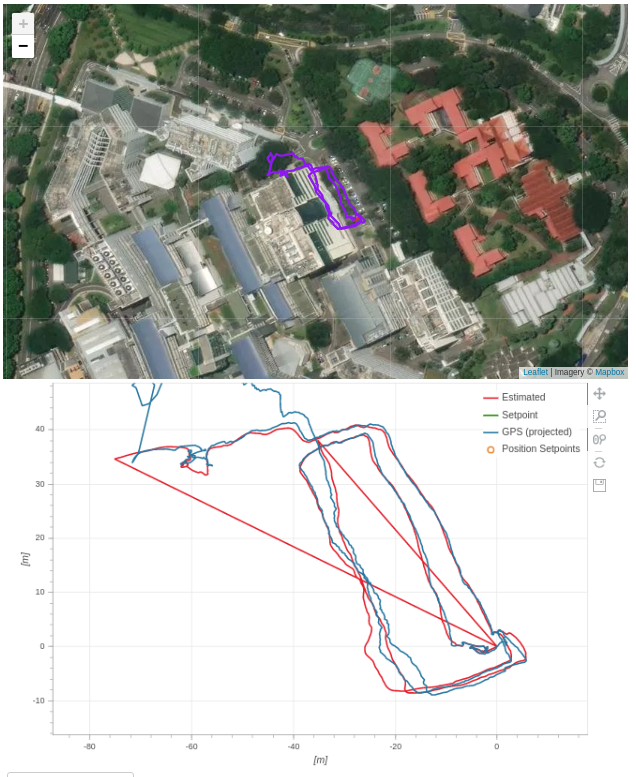
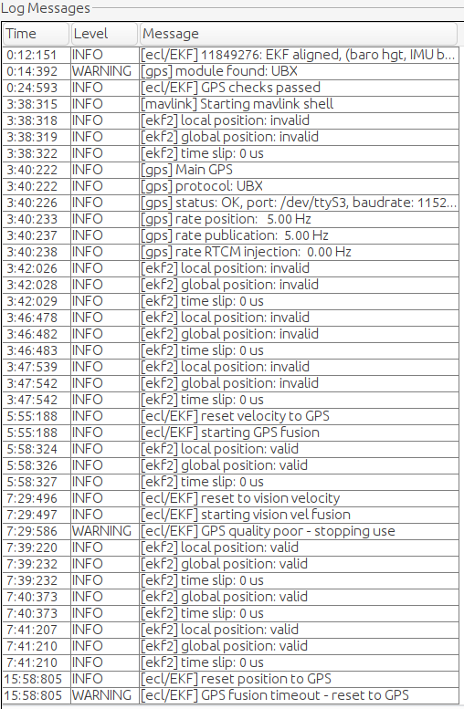
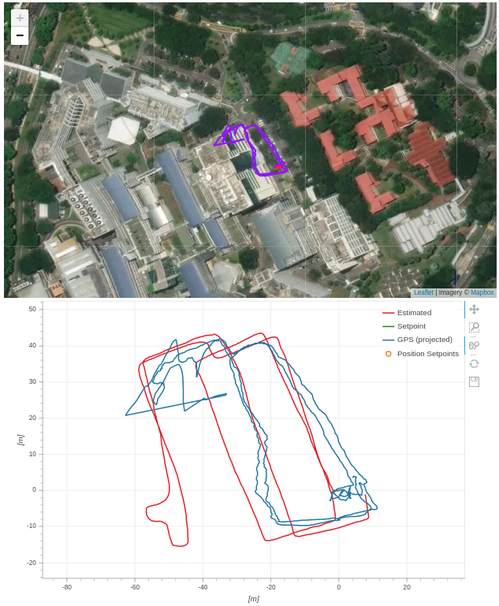
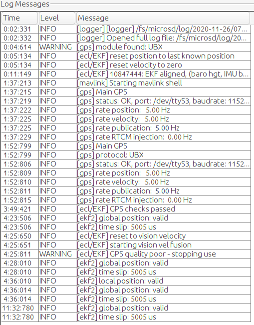

# ECL EKF Yaw Fusion Logics

Yaw fusion come from two sensor sources: magnetometer and GPS.

## Magnetometer Yaw Fusion

The type of fusion is controlled by the px4 parameter `mag_fusion_type` in code or equivalently `EKF2_MAG_TYPE` in parameter name.

```cpp
/**
 * Type of magnetometer fusion
 *
 * Integer controlling the type of magnetometer fusion used - magnetic heading or 3-component vector. The fuson of magnetomer data as a three component vector enables vehicle body fixed hard iron errors to be learned, but requires a stable earth field.
 * If set to 'Automatic' magnetic heading fusion is used when on-ground and 3-axis magnetic field fusion in-flight with fallback to magnetic heading fusion if there is insufficient motion to make yaw or magnetic field states observable.
 * If set to 'Magnetic heading' magnetic heading fusion is used at all times
 * If set to '3-axis' 3-axis field fusion is used at all times.
 * If set to 'VTOL custom' the behaviour is the same as 'Automatic', but if fusing airspeed, magnetometer fusion is only allowed to modify the magnetic field states. This can be used by VTOL platforms with large magnetic field disturbances to prevent incorrect bias states being learned during forward flight operation which can adversely affect estimation accuracy after transition to hovering flight.
 * If set to 'MC custom' the behaviour is the same as 'Automatic, but if there are no earth frame position or velocity observations being used, the magnetometer will not be used. This enables vehicles to operate with no GPS in environments where the magnetic field cannot be used to provide a heading reference. Prior to flight, the yaw angle is assumed to be constant if movement tests controlled by the EKF2_MOVE_TEST parameter indicate that the vehicle is static. This allows the vehicle to be placed on the ground to learn the yaw gyro bias prior to flight.
 * If set to 'None' the magnetometer will not be used under any circumstance. If no external source of yaw is available, it is possible to use post-takeoff horizontal movement combined with GPS velocity measurements to align the yaw angle with the timer required (depending on the amount of movement and GPS data quality). Other external sources of yaw may be used if selected via the EKF2_AID_MASK parameter.
 * @group EKF2
 * @value 0 Automatic
 * @value 1 Magnetic heading
 * @value 2 3-axis
 * @value 3 VTOL custom
 * @value 4 MC custom
 * @value 5 None
 * @reboot_required true
 */
PARAM_DEFINE_INT32(EKF2_MAG_TYPE, 0);
```

The default `automatic` mode may not be suitable for indoor-outdoor transition, as the fusion always use magnetometer readings in flight.

The main logics is written in `controlMagFusion()` within file `mag_control.cpp`.

### `MAG_FUSE_TYPE_NONE`
The magnetometer is only used pre-flight, for gyro bias estimation.

This mode should be used, if we do not want to have yaw drift, when we perform indoor-outdoor transitions

### `MAG_FUSE_TYPE_INDOOR` aka `MC custom`

This mode will inhibit yaw fusion (`_is_yaw_fusion_inhibited` sets to true), only if GPS and Vision position / velocity fusion is not used. In our use case, the mode has no practical use.

### 26/11 Tests

4 tests were conducted to test different combinations of magnetometer settings and vision .
1. MC custom & Vision OFF
2. MC custom & Vision ON
3. None & Vision OFF
4. None & Vision ON

Tests Results:

1. Test 1 [MC custom & Vision OFF](MCGps.ulg)



2. Test 2 [MC custom & Vision ON](MCVision.ulg)



3. Test 3 [None & Vision OFF](NONEGps.ulg)


4. Test 4 [None & Vsion ON](NONEVision.ulg)



Observations:

There is still a yaw drift. EKF2 fusion setting is 321 for these 4 tests. To include GPS yaw fusion, the setting should be changed to 450.