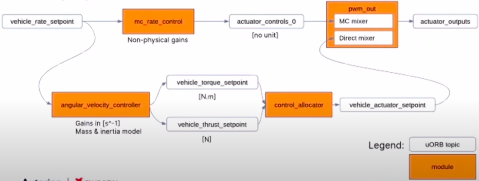

import Mermaid from '@theme/Mermaid';

# PX4 Dynamic Control Allocation

<https://www.youtube.com/watch?v=xjLM9whwjO4>

<https://github.com/PX4/PX4-Autopilot/pull/13351>

## Introduction


Control allocation is a part of the PX4 system that computes the actuator commands from torque and thrust setpoints.

The old version of PX4 uses static mixing tables generated by mixers. A mixer uses the geometry of a vehicle to calculate an effectiveness matrix consisting of the force and torque generated by each actuator. Then the pseudo-inverse of the effectiveness matrix, aka the mixer matrix, is calculated. The mixer matrix can be multiplied with the moment and thrust setpoints to obtain the required actuator commands. All these works are done at compile time, therefore the mixing table cannot be modified during runtime. To achieve dynamic control allocation, we need to be able to change the mixing table at runtime.



The new control_allocator module does so by calculating the effectiveness matrix and its inverse in the controller. Its input, torque and thrust setpoints, are calculated in the angular_velocity_controller module which uses mass and inertia parameters to get gains with physical units. It also reads parameters that indicate which rotors are disabled and updates the effectiveness matrix accordingly. To integrate these modules into the existing system, a direct mixer is used.

## Overall Structure

<!-- Temporarily located [here](https://lirc572.github.io/PX4-Notes/#/content/Control-Allocation) -->

<details>
<summary><b>angular_velocity_controller</b></summary>

1. Calculate **thrust_sp**
   - **thrust_sp** = thrust * vm_mass * G / hover_thrust
2. Calculate **torque_sp**
   - angular_accel_sp = gain_p .* angular_velocity_error - gain_d .* angular_acceleration
   - torque_ff = angular_velocity_int + gain_ff .* angular_velocity_sp
   - **torque_sp** = inertia * angular_accel_sp + torque_ff + angular_velocity x (inertia * angular_velocity)
   - angular_velocity_int = angular_velocity_int + i_factor * gain_i * angular_velocity_error * dt
3. Publish **thrust_sp** and **torque_sp**

<details>
<summary>Parameters</summary>

Parameter     | Description
---           | ---
AVC_*_P       | Body * axis angular velocity P gain (unit 1/s)
AVC_*_I       | Body * axis angular velocity I gain (unit Nm/rad)
AVC_*_D       | Body * axis angular velocity D gain
AVC_*_I_LIM   | Body * axis angular velocity integrator limit (unit Nm)
AVC_*_FF      | Body * axis angular velocity feedforward gain (unit Nm/(rad/s))
AVC_*_K       | Body * axis angular velocity controller global gain
VM_MASS       | Mass (unit kg)
VM_INERTIA_XX | Inertia matrix, XX component (unit kg m^2)
VM_INERTIA_YY | Inertia matrix, YY component (unit kg m^2)
VM_INERTIA_ZZ | Inertia matrix, ZZ component (unit kg m^2)
VM_INERTIA_XY | Inertia matrix, XY component (unit kg m^2)
VM_INERTIA_XZ | Inertia matrix, XZ component (unit kg m^2)
VM_INERTIA_YZ | Inertia matrix, YZ component (unit kg m^2)
MPC_THR_HOVER | Hover thrust (Vertical thrust required to hover)
MPC_USE_HTE   | Hover thrust source selector (Set false to use the fixed parameter MPC_THR_HOVER Set true to use the value computed by the hover thrust estimator) see [this PR for details](https://github.com/PX4/PX4-Autopilot/pull/13981#issue-364553361)

Reference: <https://docs.px4.io/master/en/advanced_config/parameter_reference.html#angular-velocity-control>

</details>

<details>
<summary>uORB Subscriptions</summary>

Topic                        | Description
---                          | ---
control_allocator_status     | `torque_setpoint_achieved`, `unallocated_torque[3]`
vehicle_angular_acceleration | `xyz[3]`
vehicle_control_mode         | `flag_control_rates_enabled` (true if rates are stabilized), `flag_armed`
vehicle_land_detected        | ...
vehicle_rates_setpoint       | `timestamp`, `roll`, `pitch`, `yaw`, `thrust_body[3]` (for multicopter, [0] and [1] are usually 0 and [2] is negative throttle demand, normalized in body NED frame [-1, 1])
vehicle_status               | `vehicle_type`
hover_thrust_estimate        | `hover_thrust` [0.1, 0.9]
vehicle_angular_velocity     | `xyz[3]`

</details>

<details>
<summary>uORB Publications</summary>

Topic                                 | Description
---                                   | ---
rate_ctrl_status                      | `timestamp`, `rollspeed_integ`, `pitchspeed_integ`, `yawspeed_integ`
vehicle_angular_acceleration_setpoint | `timestamp`, `timestamp_sample`, `xyz[3]`
vehicle_thrust_setpoint               | `timestamp`, `timestamp_sample`, `xyz[3]` (unit N)
vehicle_torque_setpoint               | `timestamp`, `timestamp_sample`, `xyz[3]` (unit N.m)

</details>

</details>

<br/>

<details>
<summary><b>control_allocator</b></summary>

1. Update effectiveness matrix (repeat for each rotor)
   - thrust = ct * axis
   - moment = ct * position x axis - ct * km * axis
   - Put thrust and moment in effectiveness matrix
2. Set 0 effectiveness if act_min >= act_max in params
3. Run allocation (pseudo-inverse)
   - mix = pseudo-inverse(effectiveness)
   - **actuator_sp** = mix * thrust_sp
   - Clip **actuator_sp**
   - control_allocated = effectiveness * actuator_sp
4. Publish **actuator_sp**
5. Publish normalized actuator_sp as **actuator_controls_4** and **actuator_controls_5** for the mixer system

<details>
<summary>Class Diagram</summary>


[Draw.io source](./img/ca.drawio)

</details>

<details>
<summary>Parameters</summary>

Parameter       | Description
---             | ---
CA_AIRFRAME     | 0 Multirotor, 1 Standard VTOL (WIP), 2 Tiltrotor VTOL (WIP)
CA_METHOD       | 0 Pseudo-inverse with output clipping, 1 Pseudo-inverse with sequential desaturation technique
CA_BAT_SCALE_EN | Battery power level scaler
CA_AIR_SCALE_EN | Airspeed scaler
CA_ACT*_MIN     | ...
CA_ACT*_MAX     | ...

Reference: <https://docs.px4.io/master/en/advanced_config/parameter_reference.html#control-allocation>

</details>

<details>
<summary>uORB Subscriptions</summary>

Parameter               | Description
---                     | ---
battery_status          | ...
airspeed                | ...
vehicle_status          | ...
vehicle_torque_setpoint | `xyz[3]`: torque setpoint along X, Y, Z body axis (in N.m)
vehicle_thrust_setpoint | `xyz[3]`: thrust setpoint along X, Y, Z body axis (in N)

</details>

<details>
<summary>uORB Publications</summary>

Parameter                 | Description
---                       | ---
vehicle_actuator_setpoint | `actuator[16]`
control_allocator_status  | `timestamp`, `allocated_torque[3]`, `allocated_thrust[3]`, `unallocated_torque[3]`, `allocated_torque[3]`, `torque_setpoint_achieved`, `thrust_setpoint_achieved`, `actuator_saturation[NUM_ACTUATORS]`
actuator_controls_4       | `control[8]`
actuator_controls_5       | `control[8]`

</details>

</details>

## SITL (Gazebo Simulation)

```bash
# Clone the repo
git clone -b lirc-ca-new https://github.com/lirc572/PX4-Autopilot.git --recursive

cd PX4-Autopilot


# Run one of the make commands below to compile and start simulation:

# Hexrotor x:
make px4_sitl_ctrlalloc gazebo_typhoon_ctrlalloc

# Quadrotor Wide:
make px4_sitl_ctrlalloc gazebo_iris_ctrlalloc

# Octorotor Coaxial:
make px4_sitl_ctrlalloc gazebo_iris_cox_ctrlalloc


# Stop one motor in PX4 Shell:
param set CA_MC_R0_CT 0
```

Commands of the control_allocator module: <https://docs.px4.io/master/en/modules/modules_controller.html#description>

:::caution
The *iris_cox* simulation does not work as expected. See the last section of this page for details.
:::

## Control Allocation Algorithm Implementation in Python

<https://deepnote.com/project/PX4-9lguiAoGSLeQGbSWiN-9-g/%2Fctrlalloc.ipynb>


## TLab Octo-Coax Model

Incomplete Gazebo Model: [GitHub link](https://github.com/lirc572/PX4-SITL_gazebo/tree/2ce391f77da6949b202d4eacda6cf8013abaee9a/models/octo_cox_tlab)

<details>
<summary>init script</summary>

(`ROMFS/px4fmu_common/init.d/airframes/12001_octo_cox`)

```bash
#!/bin/sh
#
# @name Octo Coaxial
#
# @type Octorotor Coaxial
# @class Copter
#
# @output MAIN1 motor 1
# @output MAIN2 motor 2
# @output MAIN3 motor 3
# @output MAIN4 motor 4
# @output MAIN5 motor 5
# @output MAIN6 motor 6
# @output MAIN7 motor 7
# @output MAIN8 motor 8
#
# @board intel_aerofc-v1 exclude
# @board bitcraze_crazyflie exclude
#

sh /etc/init.d/rc.mc_defaults
sh /etc/init.d/rc.ctrlalloc

if [ $AUTOCNF = yes ]
then
    param set MPC_XY_VEL_I_ACC 4
    param set MPC_XY_VEL_P_ACC 3

    param set RTL_DESCEND_ALT 10
    param set RTL_LAND_DELAY 0

    param set MNT_MODE_IN 0
    param set MAV_PROTO_VER 2

    param set MPC_USE_HTE 0

    # Set according to actual vehicle model
    param set VM_MASS 1.4995 # 2.05
    param set VM_INERTIA_XX 0.018343 # 0.029125
    param set VM_INERTIA_YY 0.019718 # 0.029125
    param set VM_INERTIA_ZZ 0.032193 # 0.055225

    param set CA_AIRFRAME 0
    param set CA_METHOD 1

    param set CA_ACT0_MIN 0.0
    param set CA_ACT1_MIN 0.0
    param set CA_ACT2_MIN 0.0
    param set CA_ACT3_MIN 0.0
    param set CA_ACT4_MIN 0.0
    param set CA_ACT5_MIN 0.0
    param set CA_ACT6_MIN 0.0
    param set CA_ACT7_MIN 0.0
    param set CA_ACT0_MAX 1.0
    param set CA_ACT1_MAX 1.0
    param set CA_ACT2_MAX 1.0
    param set CA_ACT3_MAX 1.0
    param set CA_ACT4_MAX 1.0
    param set CA_ACT5_MAX 1.0
    param set CA_ACT6_MAX 1.0
    param set CA_ACT7_MAX 1.0

    # KM: CCW: +ve, CW: -ve
    # PZ: 5.5cm / 22.0cm = 0.25
    # https://docs.px4.io/master/en/airframes/airframe_reference.html#octorotor-coaxial

    param set CA_MC_R0_PX 0.7071068
    param set CA_MC_R0_PY 0.7071068
    param set CA_MC_R0_PZ -0.25
    param set CA_MC_R0_CT 11.7 # 12.523
    param set CA_MC_R0_KM 0.0137 # 0.0135

    param set CA_MC_R1_PX 0.7071068
    param set CA_MC_R1_PY -0.7071068
    param set CA_MC_R1_PZ -0.25
    param set CA_MC_R1_CT 11.7 # 12.523
    param set CA_MC_R1_KM -0.0137 # -0.0135

    param set CA_MC_R2_PX -0.7071068
    param set CA_MC_R2_PY -0.7071068
    param set CA_MC_R2_PZ -0.25
    param set CA_MC_R2_CT 11.7 # 12.523
    param set CA_MC_R2_KM 0.0137 # 0.0135

    param set CA_MC_R3_PX -0.7071068
    param set CA_MC_R3_PY 0.7071068
    param set CA_MC_R3_PZ -0.25
    param set CA_MC_R3_CT 11.7 # 12.523
    param set CA_MC_R3_KM -0.0137 # -0.0135

    param set CA_MC_R4_PX 0.7071068
    param set CA_MC_R4_PY -0.7071068
    param set CA_MC_R4_PZ 0.25
    param set CA_MC_R4_CT 11.7 # 12.523
    param set CA_MC_R4_KM 0.0137 # 0.0135

    param set CA_MC_R5_PX 0.7071068
    param set CA_MC_R5_PY 0.7071068
    param set CA_MC_R5_PZ 0.25
    param set CA_MC_R5_CT 11.7 # 12.523
    param set CA_MC_R5_KM -0.0137 # -0.0135

    param set CA_MC_R6_PX -0.7071068
    param set CA_MC_R6_PY 0.7071068
    param set CA_MC_R6_PZ 0.25
    param set CA_MC_R6_CT 11.7 # 12.523
    param set CA_MC_R6_KM 0.0137 # 0.0135

    param set CA_MC_R7_PX -0.7071068
    param set CA_MC_R7_PY -0.7071068
    param set CA_MC_R7_PZ 0.25
    param set CA_MC_R7_CT 11.7 # 12.523
    param set CA_MC_R7_KM -0.0137 # -0.0135
fi

set MAV_TYPE 13

# set MIXER octo_cox
set MIXER direct
set PWM_OUT 12345678
```

</details>

## Problems

Currently the iris_cox simulation does not work as expected. The same gazebo model works with the old control allocation implementation (`make px4_sitl gazebo_iris_cox`) but not under the new control allocation structure.

With the new implementation, as long as `CA_ACT*_MIN` is set to be >= `CA_ACT*_MAX`, the corresponding PWM output will be set to 1500. By default all `CA_ACT*_MIN` and `CA_ACT*_MAX` are set to `0.0`, so any unconfigured motor will output `1500`.

Below are some simulation results:

- only configure R0-R3 → works
- only configure R4-R7 → accelerate upwards as soon as arm
- configure all R0-R7 → accelerate upwards as soon as arm
- configure R0 → okay to arm
- configure R4 → upsidedown
- configure R0-R3 + R4 → okay to arm
- configure R0-R3 + R5 → okay to arm
- configure R0-R3 + R4 + R5 → when arm, front goes up → upsidedown
- configure R0-R3 + R6 → okay to arm
- configure R0-R3 + R7 → okay to arm
- configure R0-R3 + R6 + R7 → when arm, front goes up → upsidedown

Below are my guesses of what went wrong:

- Even if the PWM output of a motor is 1500 (when left unconfigured), gazebo does not necessarily simulate the prop rotating at that speed, since the vehicle stays on the ground even if all lower 4 motors receive a PWM output of 1500.
- There is something wrong with the gazebo motor definition, since one side of the vehicle will tilt upwards if we enable 2 lower motors at the same side even if their PWM output is only a little above 1000.

### How to Construct the iris_cox Gazebo Model:

<https://github.com/lirc572/PX4-SITL_gazebo/blob/c79686bd8d796bf4e50a0ffe521999059ac174ab/models/iris_cox_ctrlalloc/iris_cox_ctrlalloc.sdf>

- The iris_cox model is based on the original iris model in PX4-SITL_gazebo.
- Duplicate the rotor_0 - rotor_3 links and joints, and update their name and position (as rotor_4 - rotor_7).
- Add 4 new *libgazebo_motor_model* plugins to match the lower 4 motors.
- Update the *mavlink_interface* plugin, edit the control_channels → rotor5 - rotor8 based on rotor1 - rotor4.
