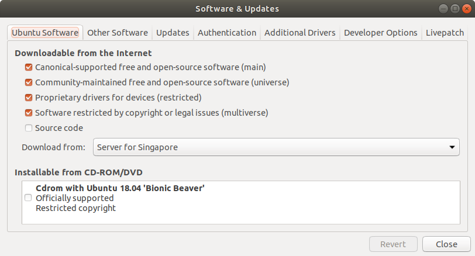
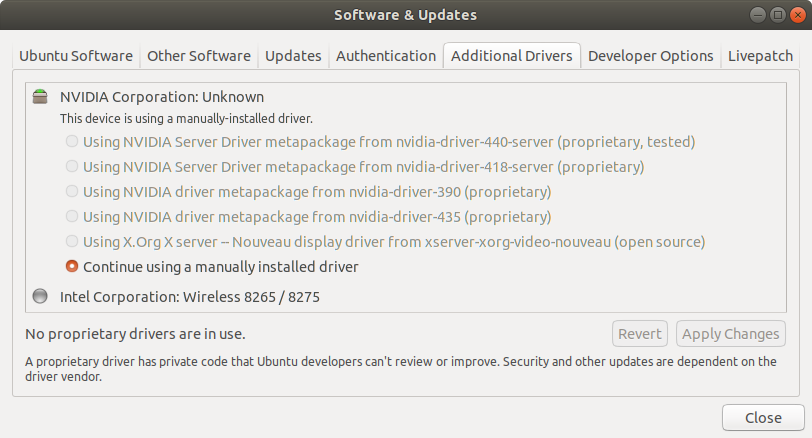

# Nvidia Intel Graphics Driver
### Option 1
1. go to [Nvidia]( https://www.nvidia.com/object/unix.html ) to download the latest driver in .run format
2. go to `single-user mode` and uninstall existing nvidia drivers `sudo apt-get purge nvidia-*`
You may need to perform `apt autoremove` to remove stray nvidia related packages. 

```
$ init 1
$ sudo apt-get purge nvidia-*
```
3. Verify That Nouveau Driver is Disabled: remove nvidia related config files under `/etc/modprobe.d/` and `/lib/modprobe.d/` 
4. excute the downloaded run file
```
$ ./NVIDIA-Linux-x86_64-440.44.run
```
5. update the following lines in grub file
   
`$ nano /etc/default/grub`

```
GRUB_CMDLINE_LINUX_DEFAULT="modprobe.blacklist=nouveau"
GRUB_CMDLINE_LINUX=""
```

`$ sudo update-grub`

6. verify the running kernel module`$ prime-select query `. Switch to nvidia if the current version is intel: `$ prime-select nvidia `

7. Verify That Nouveau Driver is Disabled

``` bash
grep nouveau /var/log/Xorg.0.log
```

### Option 2
 1. Open Software & Updates
 1. Tick first four options
 
 1. NVIDIA device drivers can be found in 'Additional Drivers'
 
 1. After the drivers have been installed, reboot
 


## Install CUDA if necessary

install CUDA 10 from [official website](https://developer.nvidia.com/cuda-downloads?target_os=Linux&target_arch=x86_64&target_distro=Ubuntu&target_version=1804&target_type=deblocal) (.deb), and follow the instructions to add apt-key. Lastly:

`sudo apt install cuda`

In .bashrc add:
``` bash
# CUDA
export PATH=/usr/local/cuda/bin${PATH:+:${PATH}}$
export LD_LIBRARY_PATH=/usr/local/cuda/lib64${LD_LIBRARY_PATH:+:${LD_LIBRARY_PATH}}
```

# Install CUDA DNN
``` bash
sudo apt install libcudnn7
```

[Official Installation Guide (CUDA)](https://docs.nvidia.com/cuda/cuda-installation-guide-linux/index.html)