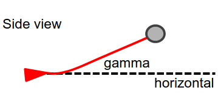
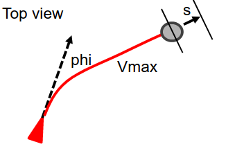
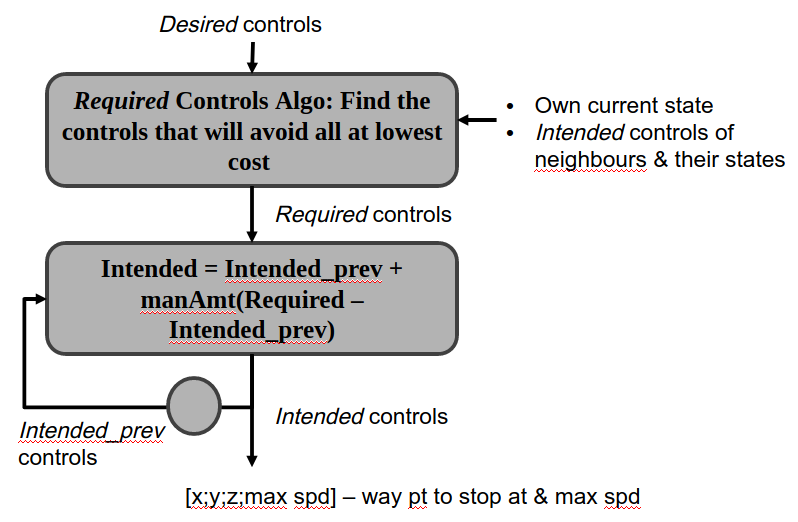
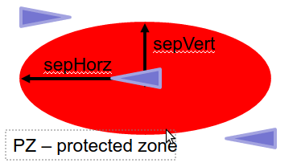
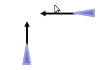
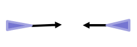
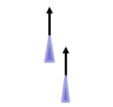

## CA Controls Implementation
- **In the current CA** : We are using the following states and the trajectory goes on without stopping​ (straight line).
1. Flight path angle (Heading $\phi$) 
2. Speed​ (Velocity)
- **In the new CA implementation** : We will use following states.
1. Heading ($\phi$)
2. Flight path angle ($\gamma$)​
3. Position deviation from way point to stop at (s)​
4. The max speed set for the flight plan ($v_{max}$)​

**Summary** : Using a one waypoint flight plan and position (x, y, z) and max speed.
    

---

## Top Level Implementation of New CA

---

## Required Controls​ & Implementation Steps

- **Step 1**: Forward simulate trajectories of own UAV using Desired controls and other UAVs using their Intended controls​

- **Step 2**: If there is collision, perturb own UAV’s controls separately and evaluate cost for each perturbation​

- **Step 3**: Update controls along gradient with steepest descent in cost & repeat the above steps until there is no collision​

- **Step 4**: If there is a solution, output it. If there is no solution, command the UAV to stop immediately​

---

## Parameters

- Separation required​ : **1.** *sepHorz*​ **2.** *sepVert*
- Maneuver amount : manAmt = ½ (default)​

---

## Cost Factors (Desired Controls)

**Deviation from Desired controls​ formulation :**
#### $\phi_{c} * \phi^2 * \gamma_{c} * \gamma^2 + v_{c} + (v_{max} - v_{max,desired})^2 + s_{c} * s^2$ 

- where $\phi_{c}$, $\gamma_{c}$, $v_{c}$, $s_{c}$ are weights that need to be chosen such that the result is consistent with what is desired, we can plot a graph of iso-cost lines to visualize and check​.

---

## Cost Factors (Rules)
- Deviation from passing rules​ (Passing on the Right Side)

| Crossing | Head On | Overtaking |
| ------------- | :-----------: |  :-----------: |
|  |  |  |

- What do we have to check​?
    - Consider CPA (Closest Point of Approach)​
    - At CPA, look at velocity of other UAV relative to own UAV​
    - It should be anti-clockwise around own UAV if own UAV is passing on the right of other UAV​

---

## Cost Factors (Collision​)
- Distance at CPA​
    - The smaller the distance, the higher the cost​
    - Moderate cost with time to reaching CPA (collision), the later the collision, the less the weight
 