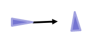
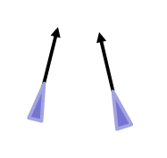
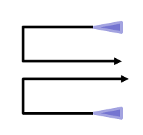
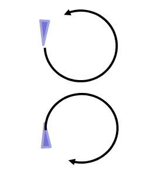
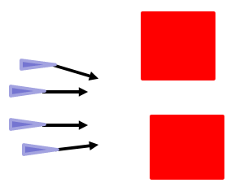

## CA Current Framework
Current implementation of Collision Avoidiance for the multi-agent UAVs is using tyhe velocity obstacles implementation. This relies on the relative velocity vector and Protected Zone to prevent collision.

Refer to paper :

`Y. Kuwata, M. T. Wolf, D. Zarzhitsky and T. L. Huntsberger, "Safe maritime navigation with COLREGS using velocity obstacles," 2011 IEEE/RSJ International Conference on Intelligent Robots and Systems, 2011, pp. 4728-4734, doi: 10.1109/IROS.2011.6094677.`
https://ieeexplore.ieee.org/document/6094677

---

## Problems Identified from Current CA

- Collisions occur, especially when congested​

- Unnecessary avoidance, disrupting mission​

- Not following rules properly all the time​

- Unfairness, some drones do all the work to avoid​

- Deadlock in tight spaces​

- Shallow crossing encounter, the two drones struggle to pass each other and could go into deadlock​

- Simplify the parameters (update rate, latency, detection range, etc) – too many and they are actually related and not easy to determine what value to assign​

- Priority issue – when a drone is given highest priority, are we sure others would be able to avoid it while it ignores everyone else​

- Handling static obstacles​

---

## Conjectures of New CA
1. Adjustment of trajectory in a mutually agreed opposite direction (pass on the right side rule) will converge stably in a non-oscillatory manner when the maneuver is half or less than what is required to avoid => deadlock won’t occur because the state of deadlock is an unstable equilibrium​

2. A resolution is always possible because the drones are assumed to start on a collision-free path and they would not change their trajectories unless it is collision-free (eventually – because they only change by half or less than what is required)​

3. The model to approximate the trajectory of the drone is representative of the actual trajectory => violation of PZ will only be because of failing to use a good model of the drone and associated buffer for uncertainties​

4. Gradient descent – there is a no local minimum in the cost function ​

---

## Collision Test Cases

### Basic :
| Passing Static UAV | Crossing | Head On | Overtaking | Shallow Crossing |
| ------------- | :-----------: |  :-----------: | :-----------: | ----- |
|  |  |  |  |   |

### Advance :
| Antipodal | Lawn Mowing | Orbit | Narrow Spaces |
| ------------- | :-----------: |  :-----------: | :-----------: |
|  |  |  |  |

---

## Considerations for implementation
- When no solution is found, we stop the drone. Note that stopping would not work if other drone is higher priority and does not try to avoid it​

- This algo may require a low level, more reactive algo as a last line of defence to avoid others. To think about this later and to define its role and for what cases it is needed. It could be:​
    - The current CA algo itself​
    - A simple repulsion rule​

---

## Optimization of implementation

- **Collision Check** : May not need to propagate with small time steps and there may be a smarter way to do this more efficiently.​
- **Fairness in avoidance** : We can exchange costs and moderate manAmt as a function of my cost vs your cost​.