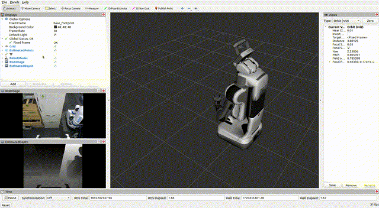

# Running ROS Nodes Using the Docker Container

At this stage, you should have a Docker image named **`depth_anything_ros:latest`**, which will be used to create a container and execute the ROS node.  
You can verify that the image was built successfully by running:

```bash
docker images
```

If the build was successful, the image **`depth_anything_ros:latest`** should appear in the list.

To verify that the setup is functioning correctly, the repository includes a sample ROS bag that can be used to generate real-time depth outputs.

---

## Docker Mounting (Required for Default Setup)

The official Dockerfile removes the `launch` and `node_scripts` directories from the image, expecting these to be mounted from the host machine at runtime.  
Without mounting these folders, the ROS launch files—including `test.launch`—will not exist inside the container and **cannot run**.

Mounting allows you to edit launch files and Python scripts on your host machine while the container uses the updated versions without rebuilding the image.

---

## Why the Default Repository Instructions Do Not Work Out of the Box

The repository suggests two ways to launch the container.  
Both approaches have issues that prevent them from functioning correctly without additional configuration.

### **1. Raw Docker Run Command (from README)**

```bash
docker run --rm --net=host -it --gpus 1 depth_anything_ros:latest /bin/bash
```

This command will fail because:

1. **The required `launch/` and `node_scripts/` directories are not mounted**  
2. **`test.launch` cannot be executed**, since it depends on files removed by the Dockerfile  

### **2. `run_docker.py` Script Provided in the Repository**

This script introduces two additional issues:

1. **It launches RViz inside the container**, causing:
   - GUI opening errors  
   - LLVM out-of-memory crashes  
   - Rendering or driver issues  

2. **It sets a hardcoded ROS master hostname (`pr1040`)**  
   If this hostname does not exist on your system, ROS reports:  
   `ERROR: unable to contact ROS master`

:::caution
For users who are already familiar with Docker mounting, networking configuration, and GUI forwarding, the `run_docker.py` script can be modified fairly easily to work correctly.  
However, these custom adjustments are **not covered in this documentation**, and users are encouraged to explore them independently if they wish to continue using the repository’s script.
:::

---

## Recommended Approach: Use the Custom Workflow

Due to the issues described above, the **Custom Workflow** (in the next section) offers the most reliable option.  
It provides:

- Pre-generated TensorRT engines  
- RViz running on the host  
- Correct mounting behavior  
- Fewer networking problems  
- Full GPU support  

This is the workflow most users should follow.

---

## If You Prefer to Use the Default Image

If you still wish to proceed with the base image, the repository’s suggested command:

```bash
docker run --rm --net=host -it --gpus 1 depth_anything_ros:latest /bin/bash
```

**will not work** unless you manually address:

1. Mounting of `launch/` and `node_scripts/`  
2. Preventing RViz from running inside the container (`use_rviz:=false`)  
3. Correct ROS networking (`-host 127.0.0.1` when using `run_docker.py`)  

A corrected Docker command would be:

```bash
docker run --rm --net=host -it --gpus 1     -v $(pwd)/launch:/root/catkin_ws/src/depth_anything_ros/launch     -v $(pwd)/node_scripts:/root/catkin_ws/src/depth_anything_ros/node_scripts     depth_anything_ros:latest /bin/bash
```

Once inside the container, run:

```bash
roscd depth_anything_ros
./scripts/onnx2tensorrt trained_data
roslaunch depth_anything_ros test.launch use_rviz:=false
```

:::note
Running RViz on the host machine is strongly recommended.
:::

---

## Expected Output

If everything is set up correctly, you should see an output similar to the example below:



