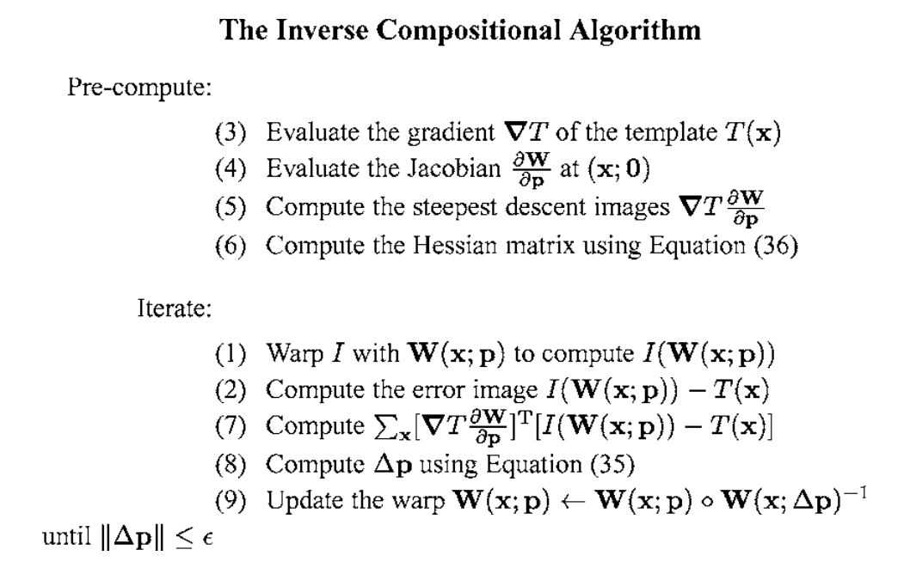
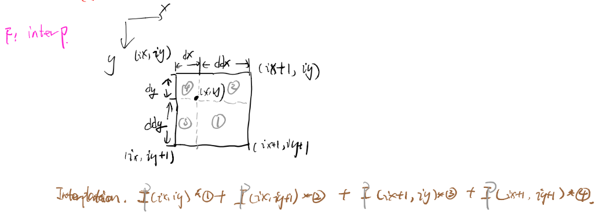

# Basalt Front End
The front end include two types of optical flow: frame to frame optical flow and patch optical frame. 

## Initialization
The front end is initialized in 
``` cpp
basalt::OpticalFlowFactory::getOpticalFlow(vio_config, calib)
```
func param: vio_config: parameters in config.json file; calib: camera info. 

return: **OpticalFlowBase::Ptr**, which is reset (initialized) by *config.optical_flow_type* and *config.optical_flow_pattern* parameter shown in the table.
``` cpp
class OpticalFlowBase {
 public:
  using Ptr = std::shared_ptr<OpticalFlowBase>;
  tbb::concurrent_bounded_queue<OpticalFlowInput::Ptr> input_queue;
  tbb::concurrent_bounded_queue<OpticalFlowResult::Ptr>* output_queue = nullptr;
  Eigen::MatrixXf patch_coord;
};
```

The **input_queue** is set to be the stereo image buffer queue with tbb::concurrent_bounded_queue to handle multithread sharing.
The **output_queue** passes to vio vision_data_queue.


### Parameters
|param  | type  |value used | function  |
|---|---|---|---|
|  config.optical_flow_type | "frame_to_frame" / "patch"  | "frame_to_frame"  |  decide optical flow method: "patch" to use PatchOpticalFlow and "frame_to_frame" to use FrameToFrameOpticalFlow |
| config.optical_flow_pattern  | 24/52/51/50  |  50 |  optical flow pattern shown in the below image |
|   |   |   |   |


``` cpp
Optical flow patterns:
The pattern is used for each key point to buid a patch when comparing matches
pattern24:
           00  01
  
       02  03  04  05
  
   06  07  08  09  10  11
  
   12  13  14  15  16  17
  
       18  19  20  21
  
           22  23

pattern52:
           00  01  02  03
  
       04  05  06  07  08  09
  
   10  11  12  13  14  15  16  17
  
   18  19  20  21  22  23  24  25
  
   26  27  28  29  30  31  32  33
  
   34  35  36  37  38  39  40  41
  
       42  43  44  45  46  47
  
           48  49  50  51 

Weights of pattern52:
                       {-3, 7},  {-1, 7},  {1, 7},   {3, 7},
                {-5, 5},  {-3, 5},  {-1, 5},  {1, 5},   {3, 5},  {5, 5},
      {-7, 3},  {-5, 3},  {-3, 3},  {-1, 3},  {1, 3},  {3, 3}, {5, 3},   {7, 3},
      {-7, 1},  {-5, 1},  {-3, 1},  {-1, 1},  {1, 1},  {3, 1}, {5, 1},   {7, 1},
      {-7, -1}, {-5, -1}, {-3, -1}, {-1, -1}, {1, -1}, {3, -1}, {5, -1},  {7, -1},
      {-7, -3}, {-5, -3}, {-3, -3}, {-1, -3}, {1, -3}, {3, -3}, {5, -3},  {7, -3},
               {-5, -5}, {-3, -5}, {-1, -5}, {1, -5},  {3, -5}, {5, -5},
                      {-3, -7}, {-1, -7}, {1, -7},  {3, -7}

pattern51 is the same as Pattern52 but twice smaller in terms of weight.
pattern50 is the same as Pattern52 but 0.75 smaller.

```

## data structure
``` cpp
struct OpticalFlowInput {
  using Ptr = std::shared_ptr<OpticalFlowInput>;
  int64_t t_ns;
  std::vector<ImageData> img_data;
};
```

``` cpp
struct OpticalFlowResult {
  using Ptr = std::shared_ptr<OpticalFlowResult>;
  int64_t t_ns;
  //observation size depends on the number of cameras, 2 in our case
  //KeypointId:
  //AffineCompact2f:
  std::vector<Eigen::aligned_map<KeypointId, Eigen::AffineCompact2f>> observations;  
  OpticalFlowInput::Ptr input_images; // one image frame from the input_queue of images
};
```

``` cpp
/// ids for 2D features detected in images
using FeatureId = int;
/// identifies a frame of multiple images (stereo pair)
using FrameId = int64_t;
/// identifies the camera (left or right)
using CamId = std::size_t;

struct KeypointsData {
  /// collection of 2d corner points: pixel location  (indexed by FeatureId) 
  std::vector<Eigen::Vector2d, Eigen::aligned_allocator<Eigen::Vector2d>> corners;
  /// collection of feature orientation (in radian) with same index as `corners`(indexed by FeatureId)
  std::vector<double> corner_angles;
  /// collection of feature descriptors with same index as `corners` (indexed by FeatureId)
  std::vector<std::bitset<256>> corner_descriptors;
  Eigen::aligned_vector<Eigen::Vector4d> corners_3d;
  std::vector<FeatureHash> hashes;
  HashBowVector bow_vector;
};
```

``` cpp
Patch
```

## FrameToFrameOpticalFlow

### Constructor
- calculate R and T between if there is more than one cameras.
- initialize the `processingLoop()` thread and use a smart pointer to handle resource.

### processingLoop
Keep poping OpticalFlowInput from the input_queue and process it with `processFrame(input_ptr->t_ns, input_ptr)` function until we get a nullptr from the input_queue.

### processFrame
Input(int64_t curr_t_ns, OpticalFlowInput::Ptr& new_img_vec)
#### first frame initialization
1. initialize **transforms** (OpticalFlowResult::Ptr)
``` cpp
transforms.reset(new OpticalFlowResult);
transforms->input_images = new_img_vec; 
```
2. initialize **pyramid**(std::shared_ptr<std::vector<basalt::ManagedImagePyr<u_int16_t>>>)
``` cpp
pyramid->resize(calib.intrinsics.size());
```
3. running pyramid for all images in parallel
``` cpp
tbb::parallel_for(tbb::blocked_range<size_t>(0, calib.intrinsics.size()),
                        [&](const tbb::blocked_range<size_t>& r) {
                          for (size_t i = r.begin(); i != r.end(); ++i) {
                            pyramid->at(i).setFromImage(
                                *new_img_vec->img_data[i].img,
                                config.optical_flow_levels);
                          }
                        });

//[tbb.parallel_for(blocked_range<T>(begin,end,grainsize), func(const tbb::blocked_range<size_t>& r))](https://software.intel.com/en-us/node/506057)
//[&] means "capture by reference", [=] means "capture by value"
//setFromImage(const ManagedImage<T>& other, size_t num_levels) sets image pyramid from other image
// @param other image to use for the pyramid level 0
```

The **ManagedImagePyr** class is used to calculate pyramid of the input image. Noted that the pyramid is stored as a (1+1/2)w x h image shown as the zebra image. A gaussian kernel is used to subsampling the image and every even-numbered row and colum have to be removed. The kernel is shown as this template.
``` cpp
1/256 * cov[image x kernel] + 0.5
1 & 4 & 6 & 4 & 1
4 & 16 & 24 & 16 & 4
6 & 24 & 36 & 24 & 6
4 & 16 & 24 & 16 & 4
1 & 4 & 6 & 4 & 1
```
 
``` cpp
// only left important function here
template <typename T, class Allocator = DefaultImageAllocator<T>>
class ManagedImagePyr {
 public:
  using Ptr = std::shared_ptr<ManagedImagePyr<T, Allocator>>;

  /// @brief Set image pyramid from other image.
  inline void setFromImage(const ManagedImage<T>& other, size_t num_levels) {
	// call "Image<const T> lvl(size_t lvl)" 
		to build subimage on the image, i.e. given x, y index as well as w and h for each pyramid
	// call "void subsample(const Image<const T>& img, Image<T>& img_sub)" 
                to return const image of the certain level, one by convolution with Gaussian kernel(ubsample the image twice in vertical and horizontal direction) and removing every even-numbered row and column	
	}

 protected:
  size_t orig_w;          ///< Width of the original image (level 0)
  ManagedImage<T> image;  ///< Pyramid   // (1+1/2)w x h 
};
```
The paramid 0,1...n are stored from left to right and upper to bottom as shown in the image.


4. addPoints

- add previously points from the Left image to pts0(vector<Eigen::Vector2d>) variable
- detect points at level 0 
``` cpp
void detectKeypoints(
    const basalt::Image<const uint16_t>& img_raw, KeypointsData& kd,
    int PATCH_SIZE, int num_points_cell,
    const Eigen::aligned_vector<Eigen::Vector2d>& current_points){
	devide image into cells based on PATCH_SIZE
	put existing points into each cell
	for each cell:
		if the current cell already has previously tracked feature, skip this cell
		else detect fast feature in the grid (default: one feature per grid): cv::FAST(subImg, points, threshold); threshold is from 40->20->10->5 and make sure the point is with in EDGE_THRESHOLD = 19 of the whole image
	}
```
- put corners with keypoint_id in **transform**(local variable) and initialize new_poses0(same type as transform: Eigen::AffineCompact2f). note: transfrom is just the keypoint location on image
- track points from left to right  
``` cpp
void trackPoints(const basalt::ManagedImagePyr<u_int16_t>& pyr_1,
                   const basalt::ManagedImagePyr<u_int16_t>& pyr_2,
                   const Eigen::aligned_map<KeypointId, Eigen::AffineCompact2f>&
                       transform_map_1,
                   Eigen::aligned_map<KeypointId, Eigen::AffineCompact2f>&
                       transform_map_2, bool leftToRight = false){
/*
    1. trackPointAtLevel: Check one pyr level: if the residul = patch - data, is valid
          valid means that 1.1 at least PATTERN_SIZE / 2 number of points that both valid in template and residuals patch
                           1.2 the points transformed by the updated and optimized T can still be seen in the image 
      2. trackPoint: check if the traking is valid at all pyr levels
      3. This Func: square norm diff from "left to right transform" and "right to left transform" should be less than config.optical_flow_max_recovered_dist2

*/}
```


5. filterPoints


#### supporting functions
1. trackPoints

Track pointss between two images pyramid. Images could be from left to right/ right to left and previous to current. Noted that parameter without const here means output of the function. Also pay attention to the name, transform_map and transforms are map and vector, while transform is a single keypoint from the containers. It also applies to functions such as trackpoints and trackpoint.
``` cpp
  void trackPoints(const basalt::ManagedImagePyr<u_int16_t>& pyr_1,
                   const basalt::ManagedImagePyr<u_int16_t>& pyr_2,
                   const Eigen::aligned_map<KeypointId, Eigen::AffineCompact2f>&
                       transform_map_1,
                   Eigen::aligned_map<KeypointId, Eigen::AffineCompact2f>&
                       transform_map_2) const {

for each point in transform_map_1:
	if trackPoint(pyr_1, pyr_2, transform_1, transform_2) is valid (means more than half of the points in template and tracking patch at each leavel are within image boundries during optimization iterations)
		track points from pyr_2 to pyr_1 (valid = trackPoint(pyr_2, pyr_1, transform_2, transform_1_recovered))
			if the norm between the transform_1 and transform_1_recovered are within in config.optical_flow_max_recovered_dist2, then add this point into the transform_map_2
	

}
```

2. trackpoint
Track point from coarse to fine at all levels. The point is tracked from old_pyramid to current pyramid.
``` cpp
inline bool trackPoint(const basalt::ManagedImagePyr<uint16_t>& old_pyr,
                         const basalt::ManagedImagePyr<uint16_t>& pyr,
                         const Eigen::AffineCompact2f& old_transform,
                         Eigen::AffineCompact2f& transform)
                         {
                            for each level of the pyramid(start from the highest one):
                                scale the keypoint with respect to the transform (keypoint coordinate at the lowest layer of the pyramid)
                                build a template patch around that scaled keypoint (see the patch section to see more details)
                                perform tracking on current level (trackPointAtLevel(pyr.lvl(level), p, transform)) and check if the result is valid (check the definition in trackPointAtLevel func). 
                            update transform
                            return patch_valid (True when all levels are valid)


                         }
```
3. trackPointAtLevel
Track one point at one pyramid level. Return patch_valid, which means 
``` cpp
inline bool trackPointAtLevel(const Image<const u_int16_t>& img_2,
                                const PatchT& dp,
                                Eigen::AffineCompact2f& transform) const {
                                  for patch_valid && iteration < config.optical_flow_max_iterations:
                                    transform designed pattern with transform matrix(R * (x;y) + t, its linear/rotation part is initialized as an identity matrix, and translation part is initialized as the keypoint's coordinate)
                                    calculate residual between the template(dp) and the transformed patch(transformed_pat)
                                      check out patch section for more details in terms of residual calculation
                                    if the residual is valid:
                                      calculate increment of the rotation: inc= inv(JT*J)*JT*res
                                      update transfrom with inc 
                                      if transform.translation() is within the img_2, then the patch is still valid, otherwise break the loop with patch_valid = false

                                    else:
                                     patch_valid = false; break the loop


                                }
```

4. OpticalFlowPatch structure
This structure is used to buid a patch around a point in image, and provides function to calculate residual used for transform itertation. Noted that below are pseudo code only.

Using the inverse compositional algorithm discribed in section 3.2.1 in [Lucas-Kanade 20 Years On: A Unifying Framework](http://www.ncorr.com/download/publications/bakerunify.pdf) 

The original problem is to minimize the sum of squard error between two images, the template $$T$$ and the image $$I$$ warped back on to the coordinate frame of the template:

  $$\sum_x[I(W(x;p))-T(x)]^2$$

  We could assume that a current estimate of p is known and then iteratively solves for increments to the parameters $$\Delta p$$, i.e. the following expression is minimized: 
  
  - Forwards additive(Lucas-Kanade) algorithm: $$\sum_x[I(W(x;p+\Delta p))-T(x)]^2$$ or 

  - Frowards compositional algorithm: $$\sum_x[I(W(W(x;\Delta p);p))-T(x)]^2$$ 

However, in order to avoid a huge computational cost in re-evaluating the Hessian in every iteration, we switch the role of the image and the template to form the inverse problem, where the goal is to minimize:

  $$\sum_x[T(W(x;\Delta p)-I(W(x;p)))]^2$$

  with respect to $$\Delta p$$ and then update the warp:

  $$W(x;p) \leftarrow W(x;p) \circ W(x;\Delta p)^{-1}$$

Performing a first order Taylor expansion gives:
  $$\sum_x[T(W(x;0))+ \triangledown T \frac{\partial W}{\partial p} - I(W(x;p))]^2$$

The solution to this least-squares problem is:
  $$\Delta p = H^{-1} \sum_x[\triangledown T\frac{\partial W}{\partial p} ]^T[I(W(x;p))-T(x)]$$

where H is:
  $$H = \sum_x [\triangledown T\frac{\partial W}{\partial p} ]^T [\triangledown T\frac{\partial W}{\partial p} ]$$

Noted that the Jacobian $$\frac{\partial W}{\partial p}$$ is evaluated at (x;0) and since there is nothing in the Hssian that depends on p, it is constant across iterations and can be pre-computed. The detail diagram of the algorithm is as follow.



In Baslt, W is group SE(2),which is rigid transformations in 2D space. It has 3 degree of freedom: $$p = [t_x, t_y, \theta]$$. The derivative of SE(2) is a 2x3 matrix $$Jw _ se2 = \triangledown T\frac{\partial W}{\partial p}$$ , where $$\triangledown T$$ means template gradient and $$\frac{\partial W}{\partial p}$$ means the change of x or y with respect to SE2 parameters $$[t_x, t_y, \theta]$$. For details can check out Equ. 117 in [SE2](http://www.ethaneade.org/lie.pdf).
SE2 can be represented by:
$$SE2=\begin{bmatrix}
0 & -\theta & t_x\\
\theta & 0 & t_y\\
0 & 0 & 0
\end{bmatrix}$$

$$\bm{x} = [x, y, 1]^T$$

And $$W(x;p) = SE(2) \cdot \bm{x} = [- \theta y + t_x; \theta x + t_y; 0]$$. Thus we have:

$$\frac{\partial W}{\partial p}=\begin{bmatrix}
1 & 0 & -y\\
0 & 1 & x
\end{bmatrix}$$

``` cpp


struct OpticalFlowPatch {
  // build a patch around the center point pos in the given image
  OpticalFlowPatch(const Image<const uint16_t> &img, const Vector2 &pos) {
    setFromImage(img, pos); 
  }
  void setFromImage(const Image<const uint16_t> &img, const Vector2 &pos) {
    MatrixP2 grad; // matrix of patter_size * 2, stores the gradient, with respect to x (right) and y (down), for data!
    for i in range(pattern)
      Vector2 p = pos + pattern2.col(i);
      if (img.InBounds(p, 2)) {
        // see below images of the interGrad to know what it means
        // valGrad[0] is the interplated pixel value, valGrad[1] is grad in x direction, valGrad[2] is grad in y dirextion
        Vector3 valGrad = img.interpGrad<Scalar>(p);
        obtain intensity value for each point in the patch: data[i] = valGrad[0];
        update sum for with each intensity value: sum += valGrad[0];
        calculate each row of grad and update grad sum from the last two data of valGrad
        num_valid_points++;
      } else {
        data[i] = -1;
      }
    mean = sum / num_valid_points;
    Scalar mean_inv = num_valid_points / sum;
    // Yu: SE2: http://www.ethaneade.org/gradlie.pdf, see Equ. 119
    // http://www.ncorr.com/download/publications/bakerunify.pdf
    Eigen::Matrix<Scalar, 2, 3> Jw_se2; // hm: each column, x, y, theta. x points right, y points down
    Jw_se2.template topLeftCorner<2, 2>().setIdentity();

    MatrixP3 J_se2; // hm: pattern_size * 3, account for 2 translation and 1 rotation. reflects how each residual component changes, with regards to SE(2)

    for (int i = 0; i < PATTERN_SIZE; i++) {
      if (data[i] >= 0) {
        const Scalar data_i = data[i];
        const Vector2 grad_i = grad.row(i);
        // hm: grad_i is the current pixel's gradient
        // hm: effectively = grad_i / averaged_intensity -  averaged_grad * data_i / averaged_intensity
        ///Yu: 
        grad.row(i) =
            num_valid_points * (grad_i * sum - grad_sum * data_i) / (sum * sum);

        data[i] *= mean_inv; // hm: divide by mean for all pixels
      } else {
        grad.row(i).setZero();
      }

      // Fill jacobians with respect to SE2 warp
      // hm: the image is store in a row-major fashion, starting from the top-left corner. x correspon
      /// Yu: SE2 param [x,y,theta]
      Jw_se2(0, 2) = -pattern2(1, i); // hm: change of x, respect to rotation. Apply small angle differentiation, give dx/dtheta = -y
      Jw_se2(1, 2) = pattern2(0, i); // hm: change of y, respect to rotation. Similarly dy/dtheta = x
      // hm: J_se2 = di/dw * dw/dse2 = grad * Jw_se2
      J_se2.row(i) = grad.row(i) * Jw_se2; // hm: jecobian of each pixel = 
    }

    // hm: formulation refer to Usenko(2019), Preliminaries, with W = identity
    Matrix3 H_se2 = J_se2.transpose() * J_se2;
    Matrix3 H_se2_inv;
    H_se2_inv.setIdentity();
    H_se2.ldlt().solveInPlace(H_se2_inv); // hm: this is to solve the inverse. This is because H_se2_inv is set to identity. so the result x IS THE INVERSE

    H_se2_inv_J_se2_T = H_se2_inv * J_se2.transpose();
  }

  inline bool residual(const Image<const uint16_t> &img,
                       const Matrix2P &transformed_pattern,
                       VectorP &residual) const {

    Scalar sum = 0; // hm: stores the sum of image pixels, using valid points in the transformed pattern
    Vector2 grad_sum(0, 0);
    int num_valid_points = 0;

    for (int i = 0; i < PATTERN_SIZE; i++) {
      if (img.InBounds(transformed_pattern.col(i), 2)) {
        residual[i] = img.interp<Scalar>(transformed_pattern.col(i)); // Yu: bilinear interplatation
        sum += residual[i];
        num_valid_points++;
      } else {
        residual[i] = -1;
      }
    }

    int num_residuals = 0;

    for (int i = 0; i < PATTERN_SIZE; i++) {
      if (residual[i] >= 0 && data[i] >= 0) {
        const Scalar val = residual[i];
        // hm: sum / num_valid_points gives the averaged intensity of the patch
        residual[i] = num_valid_points * val / sum - data[i];
        num_residuals++;

      } else {
        residual[i] = 0;
      }
    }

    // hm: num_residuals indicates the number of points that both valid in data and residuals
    return num_residuals > PATTERN_SIZE / 2;
  }

  Vector2 pos; //patch center
  VectorP data;  // template patch, negative if the point is not valid
  Matrix3P H_se2_inv_J_se2_T; //inv(JT*J)*JT, typical calculation for gaussian newton optimization
  Scalar mean; //  mean of data, before deviding by mean
};
```





#### frame processing


# Draft section

``` cpp
        "config.optical_flow_detection_grid_size": 50,  // Patch size 
        "config.optical_flow_max_recovered_dist2": 1.0,  //max distance set for optical flow
        "config.optical_flow_pattern": 51,
        "config.optical_flow_max_iterations": 5,    
        "config.optical_flow_epipolar_error": 0.5,       // remove flow that valates the epipolar constrain
        "config.optical_flow_levels": 5,
        "config.optical_flow_skip_frames": 1,            // 1 means do not skip
        "config.feature_match_show": true,               // show detection and tracking result between left and right 
        "config.vio_max_states": 3,
        "config.vio_max_kfs": 5,
        "config.vio_min_frames_after_kf": 5,
        "config.vio_new_kf_keypoints_thresh": 0.7,
        "config.vio_debug": true,
        "config.vio_obs_std_dev": 0.5,                    // dev for 3d vision reprojection error
        "config.vio_obs_huber_thresh": 1.0,               // Another threshod for vision weights
        "config.vio_min_triangulation_dist": 0.05,        // the translation has to be bigger than square of this value to do trangulation
        "config.vio_outlier_threshold": 1.0,              // outlier if the norm of the residual is larger than this value
        "config.vio_filter_iteration": 4,                 // filter outliers in this iter during optimization
        "config.vio_max_iterations": 7,                   // vio optimization iteration number
        "config.vio_enforce_realtime": false,
        "config.vio_use_lm": false,                       // use gaussian newton otherwise
        "config.vio_lm_lambda_min": 1e-32,
        "config.vio_lm_lambda_max": 1e2,
        "config.vio_init_pose_weight": 1e8,                // margH postion and yaw weight
```
pitch; ///Yu: Bytes per unit data. e.g: one row contain pitch * w bytes.

# Update repo
```
git submodule sync // fix mismatch remote repo issue
git submodule update 
```

