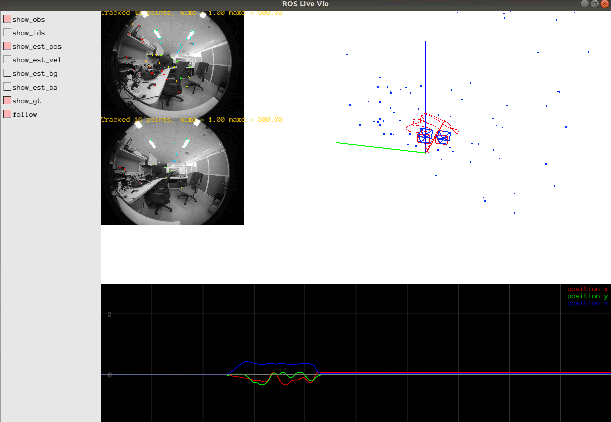

# Running Basalt VIO

Example to run on drone 23:
```bash
# terminal 1
roscore

# terminal 2 - mavros (time sync)
roslaunch mavros px4.launch gcs_url:=udp://:14540@10.42.0.1/
# need to wait for the time sync to finish in Mavros

# terminal 3 - camera driver
roslaunch tiscamera_ros tiscamera_ros_drone23.launch
# tiscamera_ros should print sync success

# terminal 4 - VIO instance
roslaunch basalt tis_23.launch
```



## Modes to Run In

Refer here for the full list of fusion modes:
https://docs.px4.io/master/en/advanced_config/tuning_the_ecl_ekf.html#ekf2_extvis

Modes to test and compare with:
- GPS + EV_VEL + ROTATE_EV (recommended)
- GPS + EV_POS + ROTATE_EV (not recommened?)
- EV_POS + EV_VEL + ROTATE_EV
- EV_POS + ROTATE_EV

## ROS to Mavros to PX4 (Odometry / vehicle_visual_odometry)

The mavros received external vision (VIO) position estimate through either POSE or ODOMETRY messages, done through remapping.

```xml
<!-- You should only remap either vision_pose or odometry, but not both -->

<!-- /mavros/vision_pose/pose is posestamped, where /mavros/vision_pose/pose is posewithcovariancestamped -->
<!-- <remap from="/mavros/vision_pose/pose" to="/basalt/pose_enu" /> -->

<remap from="/mavros/odometry/out" to="/basalt/odom_ned" />
```
For more documentation please find at https://dev.px4.io/master/en/ros/external_position_estimation.html

# System Level Tests

## 26 Oct 2020 Major Algorithmic Fixes

Bug Fixes:
- Fix bugs in LM optimisation steps, for convergence check and rollback step
- Fix a exception error in keyframe marginalisation logics (indexing non-existing frame / pose entries)

Improvements:
- Improve KF creation logics, add throttling to prevent keep creating KF under low feature environments

## Major Improvement over Outdoor Stability

Sep 2020 Update:
- GPS interference by USB / Fan is huge
- Short of J120 boards

Potential issues of the current system:
- Initialisation may fail / jitter a lot, if the drone starts at a very open field with no close features ( < 10m ?)
- When GPS is used, VIO degraded to relative measurement. It may not correct GPS jumps effectively
- Possible to explore VIO as velocity measurement, built into ECL EKF onboard PX4

### Fixed Crashing Issues

#### Frontend - Boundary Check Using Actual Camera Model

Instead of rectangular boundary check, use the actual fisheye lens boundary for optical flow tracking checks, as well as keypoint detection:

```cpp title="Example"
if (!calib.intrinsics[0].inBound(transform.translation()))
    patch_valid = false;
```

#### Backend - Triangulation Checks (Numerical)

Ignore points behind the camera:
```cpp
if (p0_triangulated[2] < 0.0)
{
    if (config.vio_debug)
        std::cout << "point " << p0_triangulated.transpose() <<" is behind the camera, throw away" << std::endl;
    continue;
}
```

#### Backend - Keyframe Selection Criteria Optimisation (Initialisation)

```cpp
  // hm: check if keyframe is needed(
  // hm: criteria 1: landmarks in the database is low (indexed by current key frames), and there are available unconnected ones
  // hm: criteria 2: only a small ratio of landmarks are observed, time to marginalise old key frames!
  if ( ( (lmdb.numLandmarks() < 12 && lmdb.numLandmarks() / opt_flow_meas->num_good_ids < 0.4  ) || double(connected0) / (lmdb.numLandmarks() + 1) < config.vio_new_kf_keypoints_thresh)
        && (frames_after_kf > config.vio_min_frames_after_kf))
    take_kf = true;


  static bool initialise_baseline = false;
  if (!initialise_baseline){
    // latest state translation to the first pose position

    try {
      double moved_dist = (frame_states.at(last_state_t_ns).getState().T_w_i.translation()).norm();
      if ( moved_dist > config.vio_min_triangulation_dist * 1.1 && frames_after_kf > config.vio_min_frames_after_kf){
        take_kf = true; // take a keyframe when the time is right after start;
        initialise_baseline = true;
      }
    }catch (const std::out_of_range& e) {
        std::cout << "Out of Range error at initialise_baseline" << std::endl;
    }
    

  }
```

#### Frontend - Good Features To Use

Define good observation points, as the points tracked at least in one consecutive pair of frames. And only those observations are used for back-end

```cpp
{
int good_ids = 0;
for (auto& obs : transforms->observations){
    for (auto& kv : obs){
    // unsigned
    if (kv.first < pre_last_keypoint_id)
        good_ids++;
    }
}

transforms->num_good_ids = good_ids;
}
```

#### Backend - Marginalise Far Frames

Detect distance between any keyframes and the latest keyframes

```cpp
if (id_to_marg < 0) { 

    int64_t last_kf = *kf_ids.crbegin(); // the last keyframe always has a state

    for (int64_t id : kf_ids) {
        auto dist = (frame_poses.at(id).getPose().translation() - frame_states.at(last_kf).getState().T_w_i.translation()).norm();

        if (dist > 10){
        id_to_marg = id;
        std::cout << "keyframe too far (> 10 m) removing" << std::endl;
        }

    }

}
```

#### Detect Speed > 15m/s, and crash automatically
```cpp
      if (last_t_ns > 0){
        auto delta_t = t_ns - last_t_ns;
        auto delta_t_w_i = T_w_i.translation() - vio_t_w_i.back();

        // hm: greater than 15 m/s
        if (delta_t_w_i.norm() / delta_t > 15 )
        {
          std::cout << "detect speed to fast > 15 m/s" << std::endl;
          abort();
        }
      }else{
        first_t_ns = t_ns;
      }
      last_t_ns = t_ns;
```

### Video Demos
<iframe width="560" height="315" src="https://www.youtube.com/embed/sjBY2vqDDo8" frameborder="0" allow="accelerometer; autoplay; clipboard-write; encrypted-media; gyroscope; picture-in-picture" allowFullScreen></iframe>

## Major Improvement over Stability

**Work Done:**
- Redesign the mounting plate (credit Yanfeng)
- Recalibrated the Pixhawk (credit Yanfeng)
- Recalibrating the prototype rig, by covering all corners of the image
    - Calibration verified by Kalibr's validator, and Jalvin's triangulation code
- Increase the IMU rates from 100Hz to 200 Hz, to make the pre-integration more stable (20ms is too long an interval)
    - Use `HIGHRES_IMU` aka `/mavros/imu/data_raw` topic
    - It has certain filtering delay, but should be negligible (few ms?)
- Discovered incorrect time sync matches between camera-imu. Fixed it (50ms delay on laptop)
    - Do not confuse the mean delay between camera and imu, and the OS delay (a measure between kernel v4l2 image reception and ros image reception). The mean delay on laptop is normally smaller than 80ms.
    - Observe the visualisation on basalt, when there is large rotation motion. If the camera is out of sync, the optimisation will shift the observing point by a lot. THIS INDICATES THE ERROR.
- Fixed various crashing bugs
    - shrinking the viewing angle to < 165 degree, by adding `alpha_offset`
    - fixed std::map error which occured in visualising the keypoints' original observation locations
    - fixed a divide by zero bug in front-end

:::note
This framework rely highly upon **calibration** and correct **hardware synchronisation**. All sensor measurement timings should be precise at few-milliseconds level.
:::

### Some Video Demos    

#### Indoor
<iframe width="560" height="315" src="https://www.youtube.com/embed/3ISeNw7O7JQ" frameborder="0" allow="accelerometer; autoplay; encrypted-media; gyroscope; picture-in-picture" allowFullScreen></iframe>

<iframe width="560" height="315" src="https://www.youtube.com/embed/H4uas0846cs" frameborder="0" allow="accelerometer; autoplay; encrypted-media; gyroscope; picture-in-picture" allowFullScreen></iframe>

#### Outdoor

<iframe width="560" height="315" src="https://www.youtube.com/embed/1LemsSnps4w" frameborder="0" allow="accelerometer; autoplay; encrypted-media; gyroscope; picture-in-picture" allowFullScreen></iframe>

**TODO:**
- The config `vio_filter_iteration` effectiveness is still to be determined
- Performance of GN and LM optimisation method test
- Test `vio_enforce_realtime` option
- Port over to TX2 to verify the performance again, try to hit >10Hz update rate.

**Full Config File**
```json title="tis_config.json"
{
    "value0": {
        "config.optical_flow_type": "frame_to_frame",
        "config.optical_flow_detection_grid_size": 60,
        "config.optical_flow_max_recovered_dist2": 5.0,
        "config.optical_flow_pattern": 51,
        "config.optical_flow_max_iterations": 5,
        "config.optical_flow_epipolar_error": 0.05,
        "config.optical_flow_levels": 4,
        "config.optical_flow_skip_frames": 1,
        "config.feature_match_show": false,
        "config.vio_max_states": 3,
        "config.vio_max_kfs": 7,
        "config.vio_min_frames_after_kf": 3,
        "config.vio_new_kf_keypoints_thresh": 0.6,
        "config.vio_debug": false,
        "config.vio_obs_std_dev": 0.5,
        "config.vio_obs_huber_thresh": 1.0,
        "config.vio_min_triangulation_dist": 0.15,
        "config.vio_outlier_threshold": 10,
        "config.vio_filter_iteration": 4,
        "config.vio_max_iterations": 7,
        "config.vio_enforce_realtime": false,
        "config.vio_use_lm": true,
        "config.vio_lm_lambda_min": 1e-32,
        "config.vio_lm_lambda_max": 1e2,
        "config.vio_init_pose_weight": 1e12,
        "config.vio_init_ba_weight": 1e1,
        "config.vio_init_bg_weight": 1e2,

        "config.mapper_obs_std_dev": 0.25,
        "config.mapper_obs_huber_thresh": 1.5,
        "config.mapper_detection_num_points": 800,
        "config.mapper_num_frames_to_match": 30,
        "config.mapper_frames_to_match_threshold": 0.04,
        "config.mapper_min_matches": 20,
        "config.mapper_ransac_threshold": 5e-5,
        "config.mapper_min_track_length": 5,
        "config.mapper_max_hamming_distance": 70,
        "config.mapper_second_best_test_ratio": 1.2,
        "config.mapper_bow_num_bits": 16,
        "config.mapper_min_triangulation_dist": 0.07,
        "config.mapper_no_factor_weights": false,
        "config.mapper_use_factors": true,
        "config.mapper_use_lm": true,
        "config.mapper_lm_lambda_min": 1e-32,
        "config.mapper_lm_lambda_max": 1e3
    }
}

```
