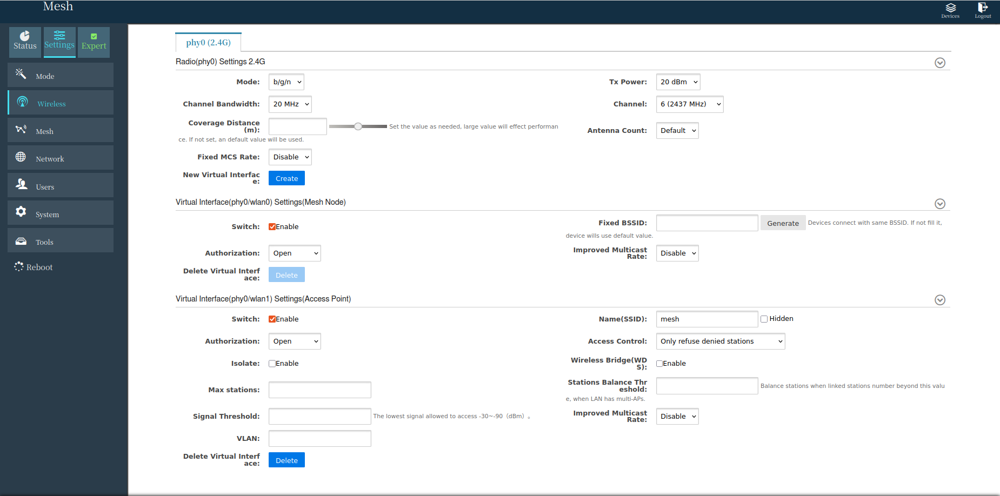
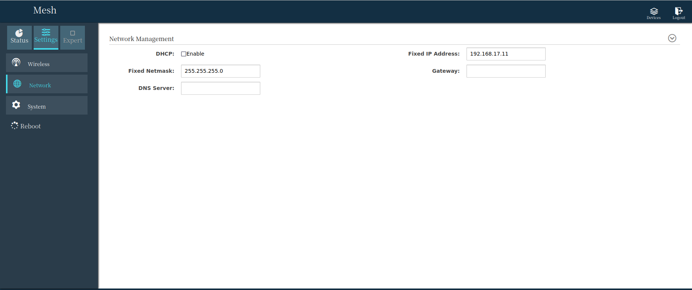
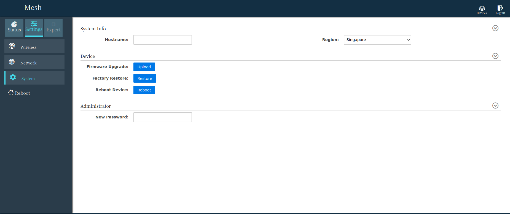

# ViuMesh Radio Communication: Setup & Installation

The ViuMesh radio system is used for communication with both the flight controller and on-board computer.

## ViuMesh Setup for OBC

<!-- Delete whatever ethernet network connections are available 

 

nmcli connection show 

sudo nmcli connection delete <connection-name>  -->

 
Setup network connection for the Viumesh communication module: 

 
```bash
sudo nmcli connection add type ethernet ifname enP8p1s0 con-name ViuMesh 
sudo nmcli connection modify ViuMesh ipv4.method manual ipv4.addresses 192.168.17.xx/24 #Replace 192.168.17.xx with relevant ip address, refer IP Allocation Table
sudo nmcli connection up ViuMesh 

 

sudo systemctl restart NetworkManager 

 

nmcli connection show #to check the active network connection and ensure visionmodule and ViuMesh is active
```
NOTE: Refer [IP Allocation Table](#ip-allocation-table) for 192.168.17.xx 

## ViuMesh Radio Configuration

After setting up the network connection for the ViuMesh Radio Communication, open the browser type the default ip: 192.168.17.1 of the ViuMesh, Mesh radio configuration window should appear prompting for password. 

 

If the mesh radio configuration webpage didn’t open or if you face any No network connection issue, you may need to check the ip of the ViuMesh radio module. 

Use nmap to find the devices and ip connected to your OBC,  

```bash
nmap –sP 192.168.17.0/24 #list all the devices connected in the network of 192.168.17.0 
```

Open the mesh radio configuration webpage using the ViuMesh Radio ip address. 

Default:	Username: admin, Password: admin 

 

If the mesh radio configuration page is accessed for the first time, it may prompt to setup the password, you can re-enter ‘admin’ as password 

 

 

Under Settings-> Wireless (Expert Mode Enabled(checkbox)), Change Channel bandwidth, channel, Tx power as below,



Under Settings-> Network, Change the Fixed IP Address of the ViuMesh Radio as per the Drone_ID (Refer IP Allocation Table) 


Under Settings-> System, Change the Region as below, 


Apply the changes and reload the mesh radio configuration webpage on the allocated ip address. 

## Integration ViuMesh with FC

Now, the flight controller has to be assigned with ip address to integrate it with the Viumesh, which will help to connect and communicate with QGC using ViuMesh

:::note
The given parameter file should be able skip the next step
:::

PX4 configures the serial port to connect to a GCS via MAVLink, using the parameters shown below:

|Parameter |Value |Description|
|--|--|--|
|MAV_2_CONFIG |1000 |Configure Ethernet port|
|MAV_2_BROADCAST |1 |Broadcast HEARTBEAT messages|
|MAV_2_MODE |0 |Send the "normal" set of MAVLink messages (i.e. the GCS set)|
|MAV_2_RADIO_CTL |0 |Disable software throttling of MAVLink traffic|
|MAV_2_RATE |100000 |Maximum sending rate|
MAV_2_REMOTE_PRT |14550 |MAVLink Remote Port of 14550 (GCS)|
|MAV_2_UDP_PRT |14550 |MAVLink Network Port of 14550 (GCS)|


Setting up ethernet address for the flight controller,

Open QGC->Analyze Tools->Mavlink Console

Check the current network settings
netman show # to show the current ethernet settings

Create network settings file using the following commands. The following commands will create a file on the microsd card, and px4 will replace the previously shown network settings with the below on next boot or netman update command
```bash
echo DEVICE=eth0 > /fs/microsd/net.cfg
	echo BOOTPROTO=static >> /fs/microsd/net.cfg
	echo IPADDR=192.168.17.xx >> /fs/microsd/net.cfg	#ip address that need to be assigned to the FC
	echo NETMASK=255.255.255.0 >>/fs/microsd/net.cfg
	echo ROUTER=192.168.17.yy >>/fs/microsd/net.cfg	#ip address of the corresponding ViuMesh
	echo DNS= 192.168.17.yy >>/fs/microsd/net.cfg #ip address of the corresponding ViuMesh
```

NOTE: You can refer to the [IP Allocation Table](#ip-allocation-table) for reference.

After the above step, you can use cat /fs/microsd/net.cfg on the mavlink console to check the network settings you have created using previous step

Reboot the flight controller or use netman update command on the mavlink console to update the network settings

Power up FC and ViuMesh, use ifconfig on mavlink console to check whether the network is UP & established


## IP Allocation Table
|Drone  |Drone_ID |OBC IP |ViuMesh IP |FC IP|
|---|--|--|--|--|
|Aira-01 |0101-SDP-001 |192.168.17.10 |192.168.17.11 |192.168.17.12 |
|Aira-02 |0101-SDP-002 |192.168.17.20 |192.168.17.21 |192.168.17.22 |
|Aira-03 |0101-SDP-003 |192.168.17.30 |192.168.17.31 |192.168.17.32|
|Aira-04 |0101-SDP-004 |192.168.17.40 |192.168.17.41 |192.168.17.42 |
|Aira-05 |0101-SDP-005 |192.168.17.50 |192.168.17.51 |192.168.17.52 |
|Ground Station | |192.168.17.100 (Laptop)| 192.168.17.01 | |

## Reference Links
1. [PX4 Ethernet Setup](https://docs.px4.io/main/en/advanced_config/ethernet_setup.html)
2. [Module Reference: System - netman](https://docs.px4.io/main/en/modules/modules_system.html#netman)
	

 

