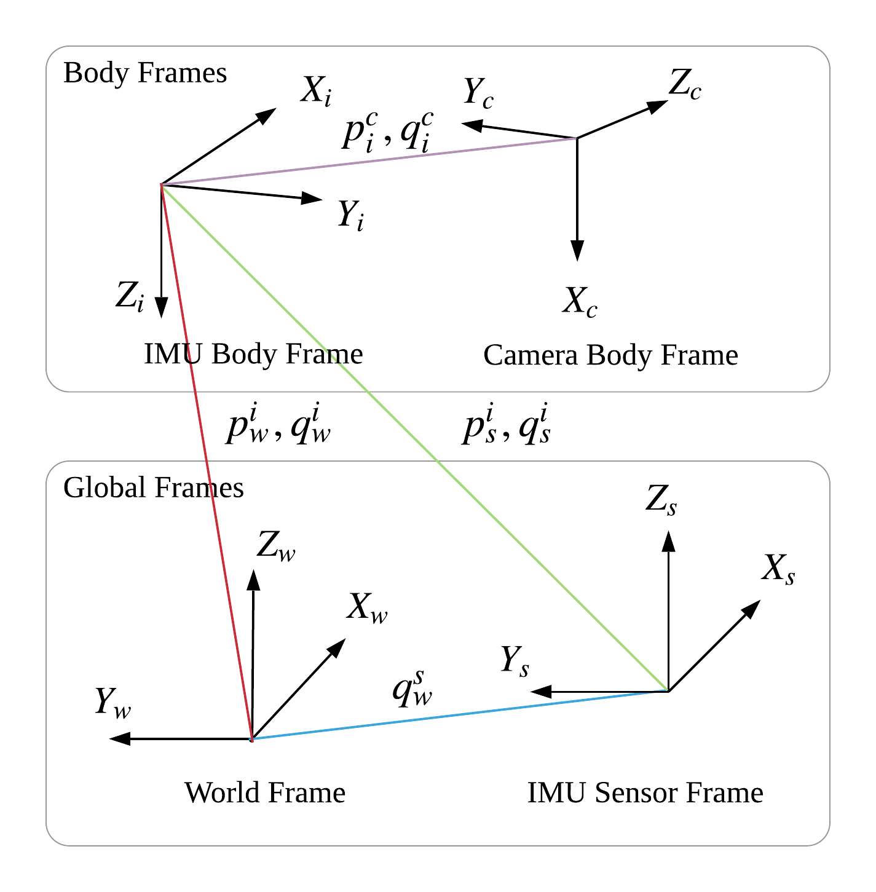

# Visual-Inertial Odometry

> package_name: ekf_sensor_fusion
>
> launch_file_location: ssf_updates/launch/visionpose_sensor_pixhawk.launch

## System Overview
The `ekf_sensor_fusion` package performs loose-coupled sensor fusion from stereo camera's visual odometry and IMU's inertial measurement to produce UAV pose estimation.

The filter is formulated to take in body-frame velocity measurement from the visual odometry module (ZED camera), instead of the pose measurement with respect to the initial body-frame.

This architecture allows temporal VO measurement errors to be rejected effectively, when an inconsistency between IMU integration and VO measurement is detected.

|  |  |
| :----------------------------------------------------------: | :---------------------------------------------------------: |
|                   pixhawk Coordinate System                   |                  State Estimation Diagram                   |

The output of this module is the pose estimation, and only the X-Y coordinates of the pose information is fed to Pixhawk's internal state filter.

## Inputs and Outputs

Inputs:

| Description              | ROS Topic Type            | ROS Topics (remapped in .launch files) | Recommended Frequency |
| ------------------------ | ------------------------- | -------------------------------------- | --------------------- |
| IMU Input (accel + gyro) | sensor_msgs/Imu           | ekf_fusion/imu_state_input             | >= 100Hz              |
| Magnetometer Input       | sensor_msgs/MagneticField | ekf_fusion/mag_state_input             | same as IMU           |
| Velocity Odometry        | geometry_msgs/PoseStamped | ekf_fusion/visionpose_measurement      | >= 15Hz               |
| Delta-Pose Odometry      | geometry_msgs/PoseStamped | ekf_fusion/zedpose_measurement         | not tested            |

:::tip Time Synchronisation of Inputs

Input ROS messages are time-synchronised internally, to the messages' header stamp. Therefore, it is important to ensure the timestamp of the inputs are sufficiently accurate.

:::


:::warning Best Practices

- IMU sensor has drift over time, even between each power cycle. Therefore, pixhawk's Pixhawk firmware is programmed to perform gyro calibration at power on. DO NOT move the UAV for the first 20 second or so, until the second boot up success beeping sound is heard (indicating completion of gyro calibration).
- Magnetometer has significant drift indoor and it almost always requires re-calibration in new environments.
  - Therefore, magnetometer input is only used during the filter initialisation, and essentially ignored when the UAV is flying. (by giving large variance in `meas_noise2` parameter)
- Delta-Pose Odometry should not be used in general, as it is not tested. (keep `velocity_measurement` as true)

:::

Outputs:

| Description                                                  | ROS Topic Type                          | ROS Topics                  |
| ------------------------------------------------------------ | --------------------------------------- | --------------------------- |
| IMU-rate pose output in world `ekf_frame`  (default NWU)     | geometry_msgs/PoseWithCovarianceStamped | /ekf_fusion/pose            |
| IMU-rate pose output, same as above but yaw is with respect to initial heading, instead of magnetic north | geometry_msgs/PoseWithCovarianceStamped | /ekf_fusion/pose_local      |
| The same as `/ekf_fusion/pose` but at VO-rate                | geometry_msgs/PoseWithCovarianceStamped | /ekf_fusion/pose_corrected  |
| FOR DEBUG ONLY (Integrated pose from IMU inputs only)        | geometry_msgs/PoseWithCovarianceStamped | /ekf_fusino/pose_integrated |

Generally, Pixhawk prefers to take in pose estimation with respected to magnetic north, at highest frequency possible, therefore `/ekf_fusion/pose` is currently used.

## Initialisation

Prior to the start of the system, the UAV should be in a stationary state,

### Configurable Parameters (.yaml)

| Parameters                 | Description                                                  | Recommended Values                 |
| -------------------------- | ------------------------------------------------------------ | ---------------------------------- |
| velocity_measurement       | Always set true, as the filter is designed and tested to receive velocity measurement | true                               |
| pose_of_camera_not_imu     | Set if the pose estimation is for camera-body or imu-body    | false                              |
| use_imu_internal_q         | If IMU has internal estimation of attitude, this could be set to true. Otherwise, the initial pose would be estimated from accelerometer (gravity-align) and magnetometer (north-align) | true                               |
| do_init_gyro_bias_estimate | When set true, the filter assumes the UAV is absolutely stationary, and all the finite gyro readings are fed as gyro bias in the states | true                               |
| imu_frame                  | The coordinate frame that IMU input is using                 | NWU                                |
| ekf_frame                  | The coordinate frame that the filter pose output is using    | NWU                                |
| sigma_distance_scale       | This parameter set how tolerant the filter is towards deviation of VO measured velocity / rotation agains IMU's integrated value. Smaller the value, the more sensitive the rejection | 3                                  |
| scale_init                 | Stereo's visual frame scale respect to world frame. This value could be obtained from real-world test of the stereo camera | 1.0                                |
| fixed_scale                | Fix visual frame scale                                       | true                               |
| fixed_bias                 | Set whether IMU bias online estimation is disabled           | false                              |
| fixed_calib                | Set whether Camera-IMU calibration estimation is disabled    | false                              |
| noise_acc                  | Noise of accelerometer measurement                           | 0.01                               |
| noise_accbias              | Drift rate of accelerometer measurement                      | 0.0004                             |
| noise_gyr                  | Noise of gyroscope measurement (much smaller than accel)     | 0.008                              |
| noise_gyrbias              | Drift rate of gyroscope                                      | 0.00002                            |
| noise_scale                | Not used                                                     | 0.0                                |
| noise_qwv                  | Not used                                                     | 0.0                                |
| noise_qci                  | Not used                                                     | 0.0                                |
| noise_pic                  | Not used                                                     | 0.0                                |
| delay                      | How much time in second VO is lagging IMU timestamps         | 0.0                                |
| **meas_noise1**            | Noise of velocity measurement. The noise should be smaller when frequency increases | 0.03 for 15Hz;<br />0.008 for 30Hz |
| **meas_noise2**            | Noise of IMU quaternion measurement                          | 9999                               |
| init/q_ci                  | attitude of camera with respect to IMU                       | -                                  |
| init/p_ci                  | position of camera with respect to IMU                       | -                                  |
| init/q_ib                  | mounting position of IMU with respect to UAV                 | -                                  |


### Initialisation Failures

The filter implemented a relatively robust initialisation check, so it is not uncommon to encounter the situation where the filter refuses to initialise. Most of the failures are reported as ROS messages to give clue for debugging.

For the convenience, common failures are listed below:

**IMU input failed to be received**

- **Symptom**: "Waiting for IMU inputs..."
- **Possible causes**: Pixhawk / mavros failure, check system_id etc.

**Some IMU input received, but not all** (failed to synchronise IMU / magnetometer)

- **Symptom**: "[ssf_core] Low number of synchronized imu/magnetometer tuples received."
- **Possible causes**: Magnetometer not connected properly

**IMU inputs are received in sync, but IMU Variance Test cannot pass**

- **Symptom**: Keep receiving "=============IMU Variance Statitics==============" message
- **Possible causes**: 
  - IMU Gravity estimate deviate too much from reference
  - Variance of accel, gyro, or magnetometer is too large over the measurement window.

**IMU input data received, but no VO measurement**

- **Symptom**: `ekf_fusion/pose` keep drifting, and `ekf_fusion/pose_local` is not publishing
- **Possible causes**: ZED camera does not start correctly, check USB connection etc


## ZED Stereo Camera Calibration

During our flight test, we confirmed that ZED stock calibration is not accurate, even with re-calibration using their official tools.

Therefore, calibration using a dedicate calibration tool like Kalibr is strongly recommended.

After the Kalibr calibration, modify the factory calibration provided by ZED company (could be obtained by SDK, or visit  http://calib.stereolabs.com/?SN=1010) with the values of the Kalibr output. The modified file should be stored in `pixhawk_v1/param/zed/settings/SNxxxxx.conf`


A sample calibration file could look like this (calibrated under VGA resolution)

``` ini
[LEFT_CAM_VGA]
cx = 333.25292570048475
cy = 191.39765841045107
fx = 340.7373436904007
fy = 340.83066466998304
k1 = -0.17236577491455016
k2 = 0.025798283381817392
p1 = 0.0
p2 = -0.00013

[RIGHT_CAM_VGA]
cx = 340.91855014058245
cy = 184.2264715537507
fx = 340.8878322679929
fy = 340.89265557837626
k1 = -0.17317038234955687
k2 = 0.026135241148153184
p1 = -0.00026
p2 = -0.0005221063830678553

[STEREO]
Baseline = 120.899
CV_2K = 0.00850606
CV_FHD = 0.00850606
CV_HD = 0.00850606
CV_VGA = 0.0032
RX_2K = -0.00420175
RX_FHD = -0.00420175
RX_HD = -0.00420175
RX_VGA = -0.0023
RZ_2K = -0.0014632
RZ_FHD = -0.0014632
RZ_HD = -0.0014632
RZ_VGA = -0.0006
```

