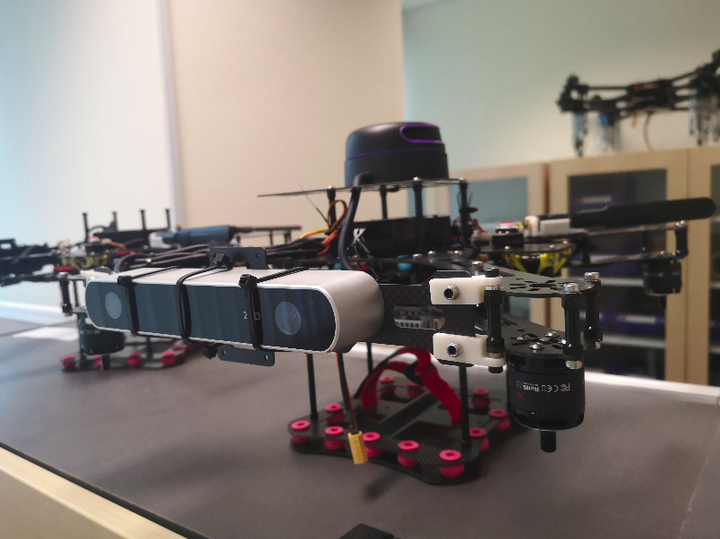
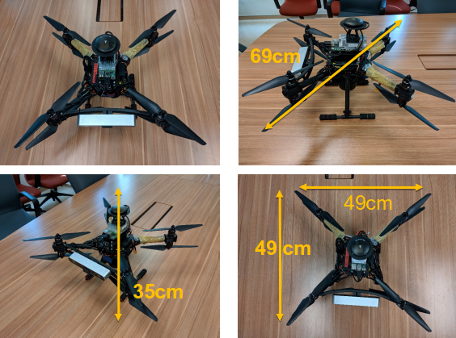

# Welcome to pixhawk Page
We present a comprehensive design and implementation for a micro aerial vehicle (MAV) that is able to perform missions, including 3D autonomous navigation, obstacle avoidance and tracking, in cluttered and realistic unknown environments without aid of global positioning system (GPS) and other external sensors or markers. Proposed modularized components are developed and tested for the MAV, including visual inertial odometry (VIO), mapping of obstacles, motion planning, target detection, and tracking systems, as well as a friendly user interface. 

## Hardware Design
The final platform was a 2.6kg octo-rotor configuration utilizing a 2213 size brushless dc motor rated at 920kV which was paired with a 9.5” in diameter by 4.5” pitch propeller with self-locking propeller hubs together with electronic speed controllers rated for 20A continuous current usage at up to 500Hz. Each propulsor was capable of providing up to 1kg of thrust when used with a 4S lithium polymer battery.

## Software Architecture
ROS was chosen as our communication framework because it provides a convenient way to
realize the interaction between different modules. The modules can be categorized into the following main parts: state estimation, mapping and motion planning, target detection, and tracking, etc. 

