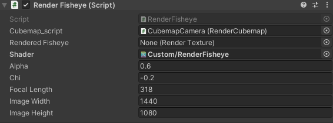

## Build-your-own
### Setup
First up, setup your own Unity project using the current stable project configurations, download from the `unity_simulator_2019` from the Bitbucket repository, this will give you a working platform to start off.

`https://bitbucket.org/nusuav/unity_simulator_2019/src/master/`

> In Unity, there are various Unity versions, (Unity 2019.x Unity 2020.x) especially those with LTS are Unity xxxx.4.x. When launching **Unity Hub** go to `installs` tab and you can download archived versions from `https://unity3d.com/get-unity/download/archive`.

:::tip
What we use is `Unity 2019.4.f9 LTS` for our scripts currently.
:::

---

## Game Objects


1. Open a **prefab**.
> Prefably use a created **prefab** (these are pre-created models), the Octocopter.x is one of them. 
2. Create a **game object**, these are such as camera, render textures, 2D textures etc. By right clicking on the left side of the Unity interface.
3. Attach a written script to the game object by **Add Component** at the bottom of the inspector (Right Side).
> Scripting essentials are the namespace and the **public** and **private** components/variables. **public** are editable in the inspector and **private** are not.
4. Attach **Public** components, with objects and your own variables.


:::tip
Some examples of scripting public/private variables : 
``` cs
    using System.Collections;
    using System.Collections.Generic;
    using UnityEngine;
    using UnityEngine.Rendering;
    
    public class NameofClass : MonoBehaviour {
        public Texture2D Texture;
        public GameObject GameObject;
        public RenderTexture RenderTexture;
        public Shader Shader;
        public Material Material;
    }
```
:::


