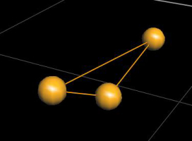
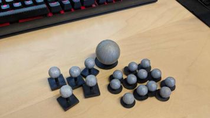

## Vicon Setup

### Vicon Object Setup 

1. Place the **Vicon balls** (about 3 or 4) onto the drone. It should be visible for the Vicon cameras to track.

2. Place the object into the Vicon tracking area, and someone at the computer should be able to see the various points of the vicon balls in the program.

 

3. **Select all** the Vicon trackable points by `ctrl` or `shift` and clicking all the points in the area. 

4. Create a **name** for the object, and add it into the Vicon program and track it.
:::tip
Add to the `<remap from="/vrpn_client_node/*****/pose" to="/mavros/vision_pose/pose" />` in sample.launch in the **Launch Setup**.
:::

### Launch Setup

:::note 
Important to download the **VRPN library** on ROS. The Debian package can be downloaded via the commands below :
``` bash
sudo apt-get update
sudo apt-get install ros-melodic-vrpn-client-ros
```
:::

1. Git clone the **VRPN official repository** from `https://github.com/ros-drivers/vrpn_client_ros`. Clone this into the `src` directory of your catkin_ws along with the Auto Fast Flt_drone or the other modules.
``` bash
    git clone https://github.com/ros-drivers/vrpn_client_ros
```

2. Go into **vrpn_client_ros/launch** and change the **sample.launch** file. 

``` xml
    <arg name="server" default="******"/> 
    - replace with the IP of computer hosting Vicon.

    <remap from="/vrpn_client_node/*****/pose" to="/mavros/vision_pose/pose" /> 
    - replace with the object name created in Vicon.
```
3. Go back to the catkin_ws directory and `catkin build`.

4. Now you are able to launch the VRPN client node using `roslaunch vrpn_client_ros sample.launch`. Test to see whether there are topics published via opening another terminal and 
``` bash
    rostopic list 
    rostopic echo /mavros/vision_pose/pose
```
